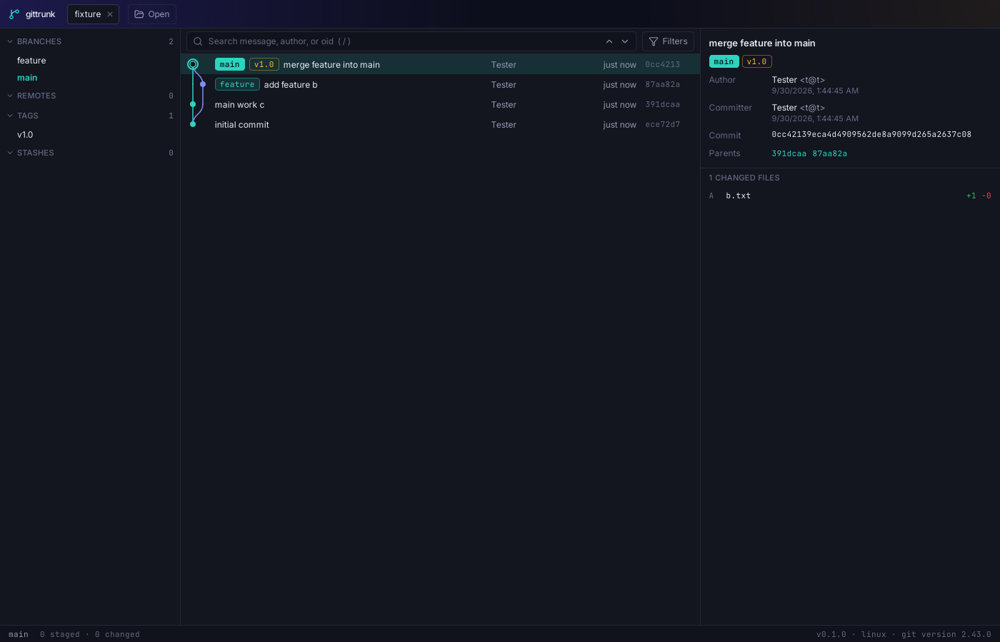

# gittrunk

A fast, native desktop Git client. An alternative to GitKraken built with Tauri 2 (Rust + libgit2) and React.

> Status: feature-complete through milestone M6; M7 (hardening and release) in progress. See [docs/PLAN.md](docs/PLAN.md).



## Features

- **Commit graph** on a virtualized canvas: lanes, branch/tag/HEAD labels, search, filters (refs, first-parent, author, path), smooth on 100k+ commits.
- **Working copy**: stage and unstage files, hunks or individual lines; split and unified diffs with syntax highlighting; discard with preview and undo; commit, amend, sign-off; stashes.
- **Full Git coverage**: clone, fetch, pull (merge / rebase / ff-only), push (with force-with-lease), branches, tags, checkout, merge, rebase, interactive rebase, cherry-pick, revert, reset, submodules, worktrees, blame, file history, reflog.
- **Drag and drop**: drop a branch on a branch to merge or rebase, a commit on a branch to cherry-pick, a ref on a commit to move it. Every destructive action shows a dry-run preview with a before/after mini graph first, and can be undone.
- **Undo anything**: an operation journal lets `Ctrl/⌘+Z` revert the last operation as one step, including hard resets and discards.
- **Conflicts**: 3-way resolver (ours / result / theirs, optional base) with per-block accept buttons; continue, skip or abort from the operation banner.
- **Remotes**: multiple remotes per repository (GitHub, GitLab, Bitbucket, Azure DevOps, self-hosted); uses your system Git credential helpers, with in-app prompts and optional OS keychain storage.
- **AI assistance (optional, off by default)**: commit messages from the staged diff, conflict suggestions, commit and branch summaries, PR descriptions, and "Ask AI" natural-language plans that are previewed before anything runs. Anthropic by default, or any OpenAI-compatible endpoint. You always see exactly what will be sent; keys live in the OS keychain.
- **Keyboard first**: command palette for every action, rebindable shortcuts, accessible focus states. Dark and light themes.

### Keyboard shortcuts (defaults)

`Mod` is `⌘` on macOS and `Ctrl` elsewhere. All shortcuts can be changed in Settings → Keyboard.

| Action                  | Shortcut                                  |
| ----------------------- | ----------------------------------------- |
| Command palette         | `Mod+K`, `Mod+Shift+P`                    |
| Keyboard shortcuts help | `?`                                       |
| Settings                | `Mod+,`                                   |
| Open repository         | `Mod+O`                                   |
| Clone repository        | `Mod+Shift+O`                             |
| Close tab / next / prev | `Mod+W`, `Ctrl+Tab`, `Ctrl+Shift+Tab`     |
| Search commits          | `Mod+F`, `/`                              |
| Refresh                 | `Mod+R`                                   |
| Fetch / Pull / Push     | `Mod+Alt+F`, `Mod+Shift+L`, `Mod+Shift+K` |
| Stage all               | `Mod+Shift+A`                             |
| Commit (in commit box)  | `Mod+Enter`                               |
| Undo last operation     | `Mod+Z`                                   |
| Ask AI                  | `Mod+Shift+I`                             |

## Android

Releases include an APK (`gittrunk_<version>_android-universal.apk`, Android 7.0+ / API 24) for phones and tablets. Sideload it: copy it to the device and open it, allowing installs from your browser or file manager. The UI adapts to the screen (bottom navigation on phones, the desktop layout on tablets).

Android has no `git` executable, so the app uses an embedded libgit2 backend. Differences from desktop:

- **HTTPS with a personal access token only.** There is no SSH support. Credentials are asked for in the app.
- **Repositories live in app storage** and are cloned in the app; there is no folder picker for existing checkouts.
- **Secrets** (tokens, AI keys) are kept in an app-private file (mode 0600) rather than in the Android Keystore in this version.
- **Not available:** hooks, commit signing, interactive rebase, submodule update, external editors. Depending on the build, non-interactive rebase, worktrees and per-file history may also be hidden; the app shows only what the platform supports.
- Builds not signed with the maintainers' key cannot be updated in place: uninstall first. See [docs/RELEASING.md](docs/RELEASING.md).

Build instructions: [docs/BUILD.md](docs/BUILD.md#building-for-android).

## Prerequisites

- Node.js 22+ and pnpm 10+ (`corepack enable`)
- Rust stable (`rustup`)
- Git on `PATH`
- Platform dependencies for Tauri 2:
  - **Windows**: Microsoft C++ Build Tools, WebView2 (preinstalled on Windows 10/11)
  - **macOS**: Xcode Command Line Tools
  - **Linux**: `libwebkit2gtk-4.1-dev libxdo-dev libssl-dev libayatana-appindicator3-dev librsvg2-dev`

Full Windows instructions: [docs/BUILD.md](docs/BUILD.md).

## Develop

```sh
pnpm install
pnpm tauri dev        # runs Vite and the Tauri app with hot reload
```

`pnpm tauri dev` regenerates `src/ipc/bindings.ts` from the Rust contract on each debug start. To regenerate without launching the app, run `pnpm bindings`.

## Quality checks

```sh
pnpm lint && pnpm format:check && pnpm typecheck && pnpm test
cd src-tauri && cargo fmt --all --check && cargo clippy --all-targets -- -D warnings && cargo test
pnpm e2e                      # integration tests (requires tauri-driver and a WebDriver)
```

## Build

```sh
pnpm tauri build                      # installers for the current platform
pnpm tauri build --bundles nsis,msi   # Windows: .exe + NSIS setup + MSI
```

Output lands in `src-tauri/target/release/` (app binary) and `src-tauri/target/release/bundle/` (installers).

## Branches and releases

- `main` holds only clean, releasable code.
- Work happens on feature/integration branches and reaches `main` through pull requests.
- Pushing a `v*` tag on `main` runs `.github/workflows/release.yml`, which builds Windows, macOS and Linux installers plus the Android APK and creates a draft GitHub Release.
- Every push to `main` or a development branch runs `Build Windows`, which uploads the `.exe`, NSIS installer and MSI as workflow artifacts, and `Build Android`, which uploads a test APK.

## Documentation

- [docs/PLAN.md](docs/PLAN.md): milestones and agent workflow
- [docs/ARCHITECTURE.md](docs/ARCHITECTURE.md): modules and IPC contract
- [docs/BUILD.md](docs/BUILD.md): building Windows installers
- [docs/DESIGN.md](docs/DESIGN.md): design tokens and components
