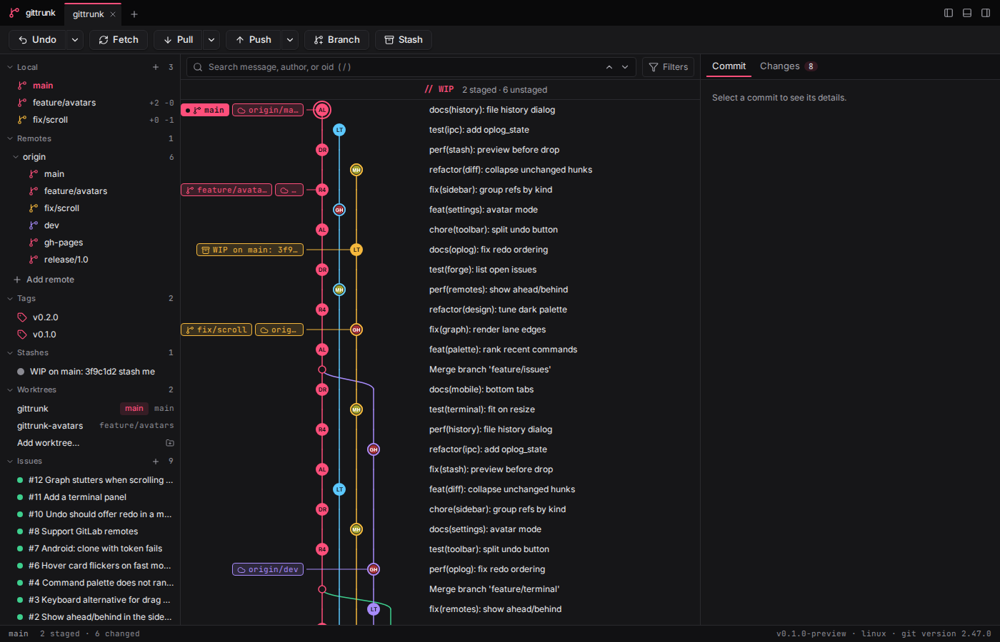
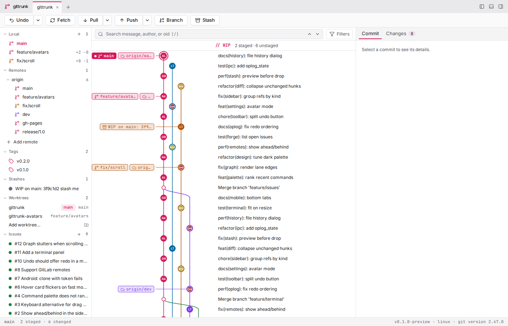
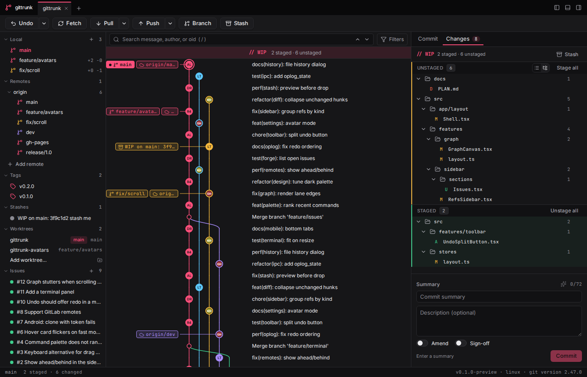
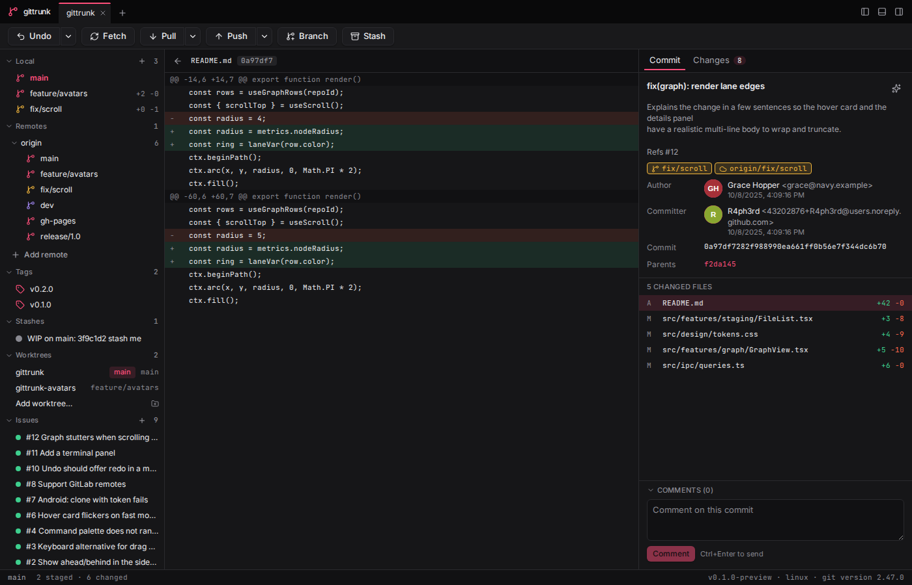
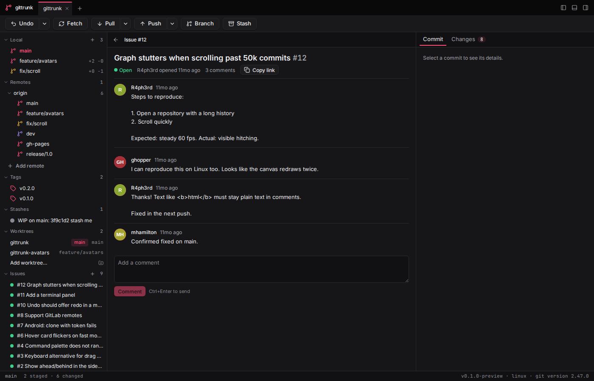
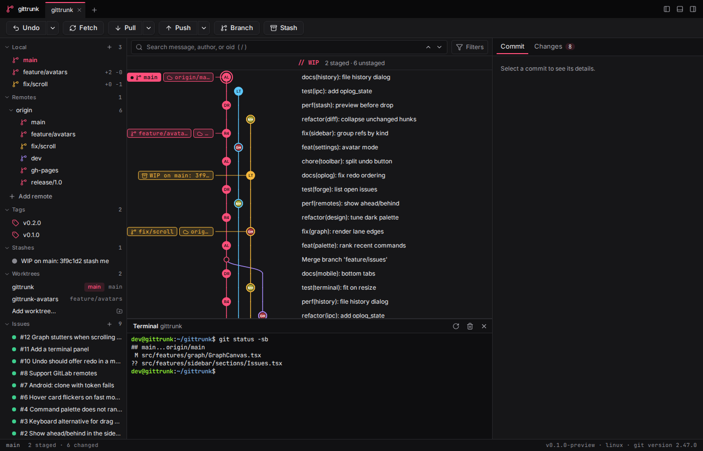
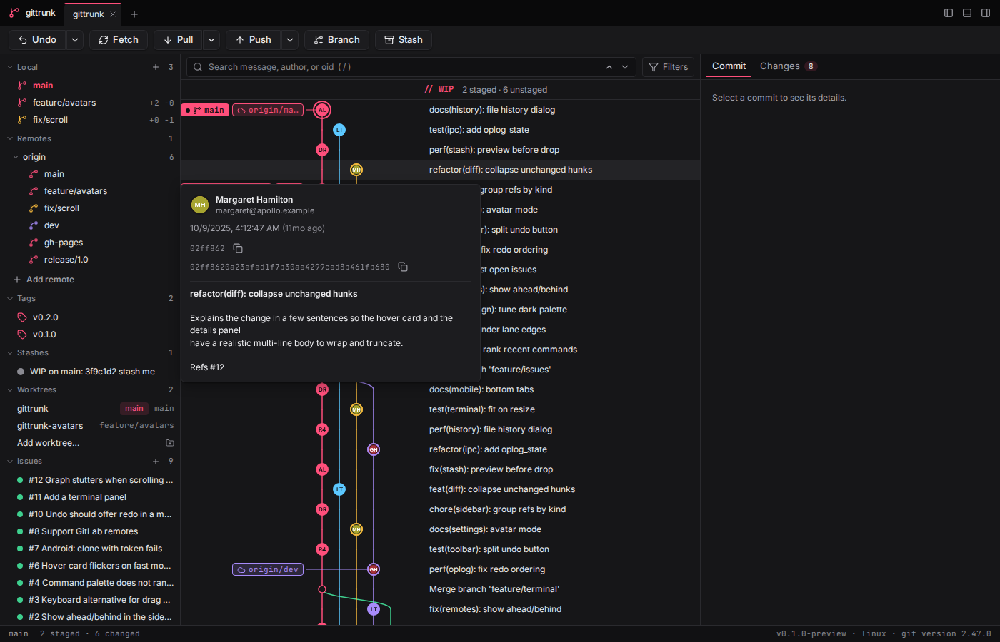
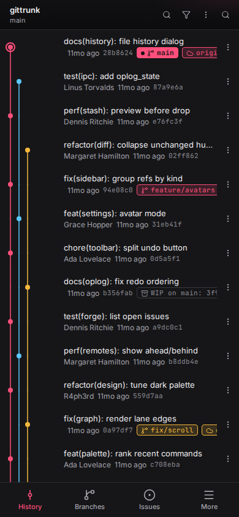
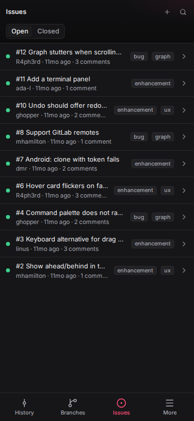

# gittrunk

A fast, native Git client for Windows, macOS, Linux and Android. An alternative to GitKraken built with Tauri 2 (Rust + libgit2) and React.



| Light theme                                              | Changes tree                                                    | Diff in the center                                          |
| -------------------------------------------------------- | --------------------------------------------------------------- | ----------------------------------------------------------- |
|  |  |       |
| **GitHub issue**                                         | **Terminal**                                                    | **Commit hover card**                                       |
|         |          |  |
| **Android history**                                      | **Android issues**                                              |                                                             |
|  |           |                                                             |

## Features

- **Commit graph** on a virtualized canvas: lanes, colored branch/tag/HEAD labels, author avatars, search, filters (refs, first-parent, author, path), smooth on 100k+ commits. Subtle scroll-parallax gradient backdrop with reduced-motion awareness.
- **Home page**: wordmark, quick actions (open, clone, init, workspaces, integrations), recent and all known repositories. New-tab start view with dialogs for opening, cloning, or creating repositories.
- **Workbench layout**: tabs, toolbar (Undo, Redo, Fetch, Pull, Push, Branch, Stash), refs sidebar, graph in the center, and a right panel with a Commit tab and a Changes tab. File diffs open in the center; sidebar, terminal and right panel can be toggled.
- **Working copy**: stage and unstage files, hunks or individual lines; split and unified diffs with syntax highlighting; discard with preview and undo; commit, amend, sign-off; stashes.
- **Full Git coverage**: clone, fetch, pull (merge / rebase / ff-only), push (with force-with-lease), branches, tags, checkout, merge, rebase, interactive rebase, cherry-pick, revert, reset, submodules, worktrees, blame, file history, reflog.
- **Drag and drop**: drop a branch on a branch to merge or rebase, a commit on a branch to cherry-pick, a ref on a commit to move it. Every destructive action shows a dry-run preview with a before/after mini graph first, and can be undone.
- **Undo and redo anything**: an operation journal lets `Mod+Z` revert the last operation as one step, including hard resets and discards, and `Mod+Shift+Z` redo it.
- **Conflicts**: 3-way resolver (ours / result / theirs, optional base) with per-block accept buttons; continue, skip or abort from the operation banner.
- **Integrated terminal (desktop only)**: a shell in the repository folder in a bottom panel, one session per open repository.
- **GitHub issues, pull requests and comments**: list, read, and create issues and pull requests; comment on issues, PRs, and commits; check out PR branches; open PRs on GitHub. Content is shown as plain text.
- **Notifications**: app activity and GitHub notifications in a popover (GitHub notifications require a token with the `notifications` scope).
- **SSH keys (desktop only)**: list public keys from `~/.ssh/`, generate new ed25519 keys.
- **Avatars**: author avatars in the graph and details, fetched by the app (see [Avatars and privacy](#avatars-and-privacy)).
- **Remotes**: multiple remotes per repository (GitHub, GitLab, Bitbucket, Azure DevOps, self-hosted); uses your system Git credential helpers, with in-app prompts and optional OS keychain storage.
- **AI assistance (optional, off by default)**: commit messages from the staged diff, conflict suggestions, commit and branch summaries, PR descriptions, and "Ask AI" natural-language plans that are previewed before anything runs. Anthropic by default, or any OpenAI-compatible endpoint. You always see exactly what will be sent; keys live in the OS keychain.
- **Android, read-only**: a follow-and-comment app for phones and tablets (see [Android](#android)).
- **Keyboard first**: command palette for every action, rebindable shortcuts, accessible focus states. Dark and light themes. `Mod+T` for a new tab.

## Download and install

Get the latest build from the [releases page](https://github.com/R4ph3rd/gittrunk/releases/latest). This README describes release 0.2.0.

| Platform | Files                                                               |
| -------- | ------------------------------------------------------------------- |
| Windows  | NSIS installer (`*_x64-setup.exe`) or `*_x64_en-US.msi`             |
| macOS    | universal `.dmg` (Apple Silicon and Intel)                          |
| Linux    | `.deb`, `.rpm` or `.AppImage`                                       |
| Android  | `gittrunk_<version>_android-universal.apk` (Android 7.0+, sideload) |

Builds are unsigned unless the maintainer has configured signing certificates:

- **Windows**: SmartScreen shows "Windows protected your PC" with publisher "Unknown". Choose **More info**, then **Run anyway**.
- **macOS**: Gatekeeper says the app cannot be verified. Right-click the app and choose **Open**, or allow it in System Settings, Privacy & Security.
- **Linux**: no prompts. Make the AppImage executable (`chmod +x`) before running it.
- **Android**: see [Android](#android).

Desktop builds need `git` on your `PATH`.

## GitHub integration

Issues, pull requests and commit comments work for repositories whose `origin` (or first GitHub remote) is on github.com. Public repositories can be read without a token (with GitHub's low anonymous rate limit); creating issues and comments needs one.

1. Create a personal access token on GitHub: a classic token with the `repo` scope (or `public_repo` for public repositories only), or a fine-grained token with Issues and Contents read and write access. For notifications, use a classic token with the `notifications` scope in addition to `repo`.
2. Open **Settings**, section **Integrations**, paste it under **GitHub token** and press **Save**. gittrunk checks it with GitHub and shows "Connected as @login". It is stored in the system keychain and never shown again; **Remove** deletes it.
3. If no token is saved, gittrunk falls back to the HTTPS credential it remembered for github.com. On Android this means the token you used to clone a repository works for issues, pull requests and comments right away.

GitHub Enterprise is not supported. GitLab, Bitbucket and Gitea integrations are coming soon.

## Avatars and privacy

Avatars are downloaded by the app itself and cached on disk (hits for 7 days, misses for 1 day); the web view never contacts avatar hosts. The default is **GitHub only**: avatars come from GitHub for GitHub `noreply` author emails and GitHub logins, and no other email information leaves your machine. In **Settings, Integrations, Avatars** you can pick:

- **Off**: no avatar requests; initials are shown instead.
- **GitHub only** (default).
- **GitHub and Gravatar**: other author emails are looked up on Gravatar, which receives a hash of each commit author's email. Choose "GitHub only" or "Off" to turn Gravatar off.

AI features send data only when you use them, after showing you exactly what will be sent.

## Keyboard shortcuts (defaults)

`Mod` is `⌘` on macOS and `Ctrl` elsewhere. All shortcuts can be changed in Settings, Keyboard.

| Action                     | Shortcut                                  |
| -------------------------- | ----------------------------------------- |
| Command palette            | `Mod+K`, `Mod+Shift+P`                    |
| Keyboard shortcuts help    | `?`                                       |
| Settings                   | `Mod+,`                                   |
| Open repository            | `Mod+O`                                   |
| Clone repository           | `Mod+Shift+O`                             |
| Close tab / next / prev    | `Mod+W`, `Ctrl+Tab`, `Ctrl+Shift+Tab`     |
| Search commits             | `Mod+F`, `/`                              |
| Refresh                    | `Mod+R`                                   |
| Fetch / Pull / Push        | `Mod+Alt+F`, `Mod+Shift+L`, `Mod+Shift+K` |
| Stage all                  | `Mod+Shift+A`                             |
| Commit (in commit box)     | `Mod+Enter`                               |
| Undo / redo last operation | `Mod+Z`, `Mod+Shift+Z`                    |
| Create branch at HEAD      | `Mod+Shift+B`                             |
| Stash working copy         | `Mod+Shift+S`                             |
| Toggle sidebar             | `Mod+B`                                   |
| Toggle terminal (desktop)  | `Mod+J`                                   |
| Toggle changes panel       | `Mod+Alt+B`                               |
| Ask AI                     | `Mod+Shift+I`                             |

## Android

Releases include an APK (`gittrunk_<version>_android-universal.apk`, Android 7.0+ / API 24) for phones and tablets. Sideload it: copy it to the device and open it, allowing installs from your browser or file manager. The UI adapts to the screen (bottom navigation on phones, the desktop layout on tablets).

The Android app is **read-only**: it is for following a project and commenting, not for writing history. You can clone, browse history, commit details and diffs, branches, tags and remotes, check out existing branches, fetch, pull fast-forward only, read the reflog, and read, create and comment on GitHub issues and commits. Staging, commits, push, branch and tag changes, merge, rebase and other history rewriting, and the terminal are not available.

Android has no `git` executable, so the app uses an embedded libgit2 backend. Other differences from desktop:

- **HTTPS with a personal access token only.** There is no SSH support. Credentials are asked for in the app, and the clone token is reused for GitHub issues and comments.
- **Repositories live in app storage** and are cloned in the app; there is no folder picker for existing checkouts.
- **Secrets** (tokens, AI keys) are kept in an app-private file (mode 0600) rather than in the Android Keystore in this version.
- **Signing**: unless the maintainer has configured a release keystore, the APK is signed with a throwaway key generated for that build. It installs normally, but a build signed with a different key cannot be updated in place: uninstall first (this removes the app's repositories). See [docs/RELEASING.md](docs/RELEASING.md).

Build instructions: [docs/BUILD.md](docs/BUILD.md#building-for-android).

## Building from source

Full instructions for every platform: [docs/BUILD.md](docs/BUILD.md). Summary:

### Prerequisites

- Node.js 22+ and pnpm 10+ (`corepack enable`)
- Rust stable (`rustup`)
- Git on `PATH`
- Platform dependencies for Tauri 2:
  - **Windows**: Microsoft C++ Build Tools, WebView2 (preinstalled on Windows 10/11)
  - **macOS**: Xcode Command Line Tools
  - **Linux**: `libwebkit2gtk-4.1-dev libxdo-dev libssl-dev libayatana-appindicator3-dev librsvg2-dev`

### Develop

```sh
pnpm install
pnpm tauri dev        # runs Vite and the Tauri app with hot reload
```

`pnpm tauri dev` regenerates `src/ipc/bindings.ts` from the Rust contract on each debug start. To regenerate without launching the app, run `pnpm bindings`.

### Quality checks

```sh
pnpm lint && pnpm format:check && pnpm typecheck && pnpm test
cd src-tauri && cargo fmt --all --check && cargo clippy --all-targets -- -D warnings && cargo test
pnpm e2e                      # integration tests (requires tauri-driver and a WebDriver)
```

### Build

```sh
pnpm tauri build                      # installers for the current platform
pnpm tauri build --bundles nsis,msi   # Windows: .exe + NSIS setup + MSI
```

Output lands in `src-tauri/target/release/` (app binary) and `src-tauri/target/release/bundle/` (installers).

## Releasing

- `main` holds only clean, releasable code.
- Work happens on feature/integration branches and reaches `main` through pull requests.
- Pushing a `v*` tag on `main` (or running the Release workflow) runs `.github/workflows/release.yml`, which builds Windows, macOS and Linux installers plus the Android APK and creates a draft GitHub Release that is published once every platform succeeded.
- Maintainer steps, signing secrets and the Android keystore: [docs/RELEASING.md](docs/RELEASING.md).
- Every push to `main` or a development branch runs `Build Windows`, which uploads the `.exe`, NSIS installer and MSI as workflow artifacts, and `Build Android`, which uploads a test APK.

## Documentation

- [docs/PLAN.md](docs/PLAN.md): milestones and agent workflow
- [docs/ARCHITECTURE.md](docs/ARCHITECTURE.md): modules and IPC contract
- [docs/BUILD.md](docs/BUILD.md): building Windows installers and the Android APK
- [docs/RELEASING.md](docs/RELEASING.md): releases and code signing
- [docs/DESIGN.md](docs/DESIGN.md): design tokens and components

## License

MIT (as declared in `src-tauri/Cargo.toml`).
