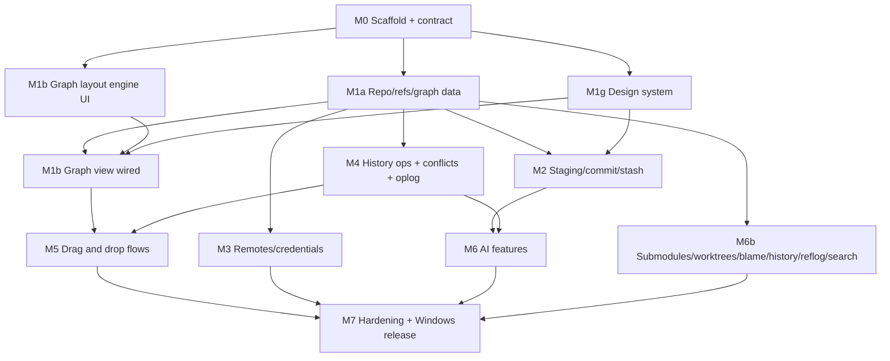

# gittrunk — Implementation Plan

Status: **M0–M7 complete.** All milestones merged on the integration branch; the full quality gate, the e2e suite and the Windows installer build pass. See §10.

gittrunk is a cross-platform desktop Git client (alternative to GitKraken) built with Tauri 2. Windows (`.exe` + NSIS installer + MSI) is the release target; macOS and Linux build from the same codebase.

---

## 1. Stack decisions

The brief's stack is kept. Deviations and clarifications, each with a two-sentence justification:

| Area                                | Decision                                                                                                                                                    | Justification                                                                                                                                                                                                                                                                                                |
| ----------------------------------- | ----------------------------------------------------------------------------------------------------------------------------------------------------------- | ------------------------------------------------------------------------------------------------------------------------------------------------------------------------------------------------------------------------------------------------------------------------------------------------------------ |
| Network ops (clone/fetch/pull/push) | **System `git` CLI**, not libgit2                                                                                                                           | libgit2 does not read `~/.ssh/config`, handles SSH agents and proxies poorly, and cannot use Git Credential Manager, which is how most Windows users authenticate to GitHub/GitLab/Bitbucket. Shelling out gives us exactly the user's existing auth setup, and progress is parsed from `--progress` stderr. |
| Graph layout                        | **Lane layout computed in Rust**, rendered on **Canvas 2D** with row virtualization; labels/text are DOM overlays only for visible rows                     | SVG with 100k+ commits creates too many nodes even when windowed, and computing lanes in JS blocks the UI thread. Rust computes lanes once per ref change and the frontend fetches visible row windows by index.                                                                                             |
| Diff display                        | **`@git-diff-view/react`** (split + unified, highlight.js-based highlighting via lowlight) for viewing; line/hunk selection layered on its line-click hooks | It is an existing, maintained diff component with both modes and syntax highlighting, so we don't rebuild a diff viewer. Staging semantics (patch building) stay in Rust, so the viewer only reports selected line ranges.                                                                                   |
| Conflict editor                     | **CodeMirror 6 + `@codemirror/merge`**                                                                                                                      | It provides a proven 3-way merge UI with editing, which the diff viewer does not. It also handles large files without virtualization work on our side.                                                                                                                                                       |
| Virtualization                      | **`@tanstack/react-virtual`**                                                                                                                               | Same family as TanStack Query, headless, and works for both DOM lists and computing canvas row windows.                                                                                                                                                                                                      |
| Keychain                            | **`keyring` crate** (Windows Credential Manager / macOS Keychain / Secret Service)                                                                          | One API over all three OS stores. Used for AI API keys and optional HTTPS tokens; git credentials otherwise go through the configured credential helper.                                                                                                                                                     |
| AI HTTP calls                       | **Made from Rust**, never from the webview                                                                                                                  | API keys never enter JS memory and no CSP exception is needed for provider domains. Streaming tokens are forwarded to the UI as typed Tauri events.                                                                                                                                                          |
| E2E tests                           | **WebdriverIO + `tauri-driver`** on Linux (xvfb) and Windows CI                                                                                             | It drives the real app against a real fixture repo, which the brief requires. `tauri-driver` does not support macOS, so macOS gets build + unit tests only.                                                                                                                                                  |
| Undo                                | **App operation journal** (`.git/gittrunk/oplog.jsonl`) recording ref/HEAD/index state before each operation, restored via the reflog OIDs                  | Raw reflog alone doesn't say which entries belong to one user action (a rebase writes many). The journal groups them so "Undo" reverts exactly one operation.                                                                                                                                                |

Everything else is as specified: Tauri 2, `git2`, React + TS + Vite, Tailwind, shadcn/ui (Radix), dnd-kit, Zustand, TanStack Query, `tauri-specta`, cmdk, lucide-react.

---

## 2. Environment constraints (please read)

These come from the environment this session runs in and change how parts of the brief are executed:

1. **Windows artifacts are built by GitHub Actions, not locally.** This container is Linux, so the local `pnpm tauri build` produces Linux bundles (`.deb`/`.AppImage`). The Windows `.exe`, NSIS and MSI come from a `windows-latest` workflow. The final milestone counts as done only when that workflow is green and has uploaded the installers as artifacts; I'll read the run status and logs through the GitHub API.
2. **Branch policy.** `main` holds only clean, checker-approved code and is the only source of releases (`v*` tags on `main` trigger `release.yml`, which refuses tags not on `main`). Development integrates on `claude/relaxed-allen-0mjwae`, the only branch this session can push. `feat/<area>-<task>` branches exist as **local worktrees only**; each is rebased and fast-forward merged into the integration branch after the checker passes, so history stays linear. At the end of each milestone, the integration branch is proposed to `main` through a pull request.
3. **The orchestrator role is played by this main session.** Claude Code subagents cannot spawn other subagents, so an `orchestrator` subagent could not dispatch work. `.claude/agents/orchestrator.md` is still written, for reuse and documentation, but here dispatching is done by the top-level session running Opus.
4. **Effort levels**: each agent file sets `model` and `effort` in frontmatter.
5. Linux Tauri system deps (`webkit2gtk-4.1`, etc.) are installed in this container, so `pnpm tauri build` runs locally for Linux bundles.
6. No code-signing certificate is available, so installers are unsigned (SmartScreen will warn). The workflow has a documented optional signing step that reads secrets.

---

## 3. Repository layout and ownership

```
gittrunk/
├── .claude/agents/            # orchestrator (shared, orchestrator only)
├── .github/workflows/         # build-agent
├── docs/                      # orchestrator (PLAN, ARCHITECTURE); DESIGN.md → design-system-agent; BUILD.md → build-agent
├── package.json, pnpm-lock.yaml, tsconfig*.json, vite.config.ts,
│   eslint/prettier config, tailwind.config.ts   # SHARED — orchestrator only
├── src-tauri/
│   ├── Cargo.toml, tauri.conf.json, capabilities/  # SHARED — orchestrator (build-agent for bundle/icons section)
│   ├── icons/                                    # build-agent
│   └── src/
│       ├── main.rs, lib.rs                       # SHARED — orchestrator
│       ├── ipc/                                  # CONTRACT — orchestrator only
│       │   ├── mod.rs        # command registration + specta export
│       │   ├── types.rs      # all DTOs crossing IPC
│       │   └── error.rs      # AppError { kind, message, detail }
│       ├── commands/         # thin handlers → services; per-area files owned by area agent
│       ├── git/              # rust-git-agent
│       │   ├── service.rs    # GitService trait
│       │   ├── libgit/       # git2-backed impl (reads, graph, diff, simple writes)
│       │   ├── cli/          # git CLI runner (network, rebase, cherry-pick seq, submodules, worktrees)
│       │   ├── graph/        # lane layout engine
│       │   ├── oplog/        # operation journal + undo
│       │   └── fixtures/     # test fixture builders
│       ├── remote/           # rust-git-agent (track d): credentials, keychain
│       └── ai/               # ai-agent: Provider trait, anthropic.rs, openai_compat.rs, prompts/
├── src/
│   ├── ipc/bindings.ts       # GENERATED by tauri-specta (committed; CI fails on drift)
│   ├── ipc/queries.ts        # TanStack Query hooks over bindings — frontend-agent
│   ├── design/               # design-system-agent: tokens.css, themes, components/ui/*, /design route
│   ├── features/
│   │   ├── graph/            # frontend-agent (track b)
│   │   ├── repo/             # frontend-agent (track a UI)
│   │   ├── staging/          # frontend-agent (track c)
│   │   ├── remotes/          # frontend-agent (track d)
│   │   ├── operations/       # frontend-agent (track e): dnd, confirm+preview dialogs, rebase editor
│   │   ├── ai/               # ai-agent (UI for its features)
│   │   └── settings/         # design-system-agent (track g)
│   ├── app/                  # shell, routing, command palette, shortcuts — frontend-agent
│   └── stores/               # Zustand stores, one file per feature, owned by that feature's agent
├── e2e/                      # frontend-agent (spec) + build-agent (runner config)
└── README.md                 # orchestrator
```

Rule: an agent writes only inside its owned paths. Contract or shared config changes are requested from the orchestrator, which applies them on the integration branch before the feature branch rebases.

---

## 4. IPC contract (defined in Phase 0)

- Single source of truth: Rust types in `src-tauri/src/ipc/types.rs` deriving `serde` + `specta::Type`. `tauri-specta` exports `src/ipc/bindings.ts` on debug builds and via `cargo run --example export-bindings` in CI; CI runs it and fails on `git diff --exit-code src/ipc/bindings.ts`.
- All commands are `async` and return `Result<T, AppError>`. `AppError.kind` is a closed enum: `NotARepo | Conflict | DirtyWorktree | AuthRequired | AuthFailed | Network | RefNotFound | InvalidInput | GitCli | AiDisabled | AiProvider | Io | Internal`.
- Repositories are addressed by `RepoId` (an opaque handle returned by `repo_open`); backend holds a `RepoRegistry` with a file watcher that emits `repo_changed { repo_id, scopes: [refs|index|worktree|config] }` so TanStack Query invalidates precisely.
- Long operations return an `OpId` immediately and stream `op_progress { op_id, phase, percent?, message }` then `op_finished { op_id, result }` events. Cancel via `op_cancel`.
- Every mutating command takes `dry_run: bool`; with `dry_run = true` it returns an `OpPreview` (resulting ref positions, commits created/dropped, predicted conflicts via in-memory merge) without touching disk. This is what powers confirm-with-preview for drag and drop and AI plans.

Command groups (stubs returning `Internal("not implemented")` in Phase 0, fully typed):

| Group       | Commands                                                                                                                                                                                            |
| ----------- | --------------------------------------------------------------------------------------------------------------------------------------------------------------------------------------------------- |
| repo        | `repo_open`, `repo_init`, `repo_clone`, `repo_close`, `repo_recent`, `repo_status`                                                                                                                  |
| graph       | `graph_load(repo, filter) → GraphMeta {row_count, lane_count}`, `graph_rows(repo, start, len) → Vec<GraphRow>`, `graph_search(repo, query) → Vec<row_index>`, `commit_details`, `commit_diff`       |
| refs        | `refs_list`, `branch_create/delete/rename`, `checkout`, `tag_create/delete`, `ref_move`                                                                                                             |
| worktree    | `status`, `diff_file(staged, context)`, `stage_paths`, `unstage_paths`, `stage_lines(path, hunks/lines)`, `unstage_lines`, `discard_lines`, `commit(message, amend)`                                |
| stash       | `stash_list/save/apply/pop/drop`                                                                                                                                                                    |
| history ops | `merge`, `rebase`, `rebase_interactive(todo)`, `rebase_continue/skip/abort`, `cherry_pick(commits)`, `revert`, `reset(mode)`                                                                        |
| conflicts   | `conflict_list`, `conflict_file(path) → {base, ours, theirs, merged}`, `conflict_resolve(path, content)`                                                                                            |
| remotes     | `remote_list/add/remove/rename/set_url`, `fetch(remote?)`, `pull`, `push(remote, refspec, force_with_lease)`, `set_upstream`, `credential_store/clear`                                              |
| advanced    | `submodule_list/update/init`, `worktree_list/add/remove`, `blame`, `file_history`, `reflog`                                                                                                         |
| oplog       | `oplog_list`, `undo`, `redo`                                                                                                                                                                        |
| ai          | `ai_config_get/set`, `ai_key_set/clear`, `ai_commit_message`, `ai_conflict_suggest`, `ai_plan(nl) → AiPlan {steps: Vec<PlannedCommand>, preview}`, `ai_plan_execute(plan_id)`, `ai_summarize(commit | branch)`, `ai_pr_description(base, head)` |
| settings    | `settings_get/set`, `keybindings_get/set`                                                                                                                                                           |

---

## 5. Milestones and dependency graph



### M0 — Scaffold (sequential; orchestrator + build-agent + design-system-agent)

- Tauri 2 + React/TS/Vite with pnpm; ESLint (flat config) + Prettier; rustfmt + clippy config; Vitest + Testing Library; Tailwind wired to CSS variables.
- `.claude/agents/*.md` for all 7 agents.
- Full IPC contract (types + stub commands) and generated `bindings.ts`, plus the drift check.
- Design token skeleton (`src/design/tokens.css`, Tailwind mapping), app shell with gradient chrome.
- CI: `ci.yml` (ubuntu + windows: fmt, clippy, cargo test, lint, typecheck, test, bindings drift) and `release.yml` (windows `tauri build`, upload NSIS + MSI + exe).
- **Accept**: all quality-gate commands pass on the stub app; the Windows workflow produces an installer for the empty shell. Proving the pipeline early removes the biggest late risk.

### M1 — Read path (parallel: tracks a, b, g)

- **a (rust-git-agent)**: `GitService` trait, libgit2 impl for open/refs/status/commit details/diffs; graph walker (topo + date order, first-parent option) and lane assignment returning windowed rows; fixture builders (linear, branchy merges, octopus, 100k-commit synthetic repo).
- **b (frontend-agent)**: canvas graph renderer (lanes, nodes, merge curves, ref labels, tags, HEAD, selection), virtualized with overlays; commit details panel; search box and filters (branch, author, date, path, text).
- **g (design-system-agent)**: tokens (color, spacing, radius, type, elevation, motion, gradients), dark + light themes, wrapped components (Button, IconButton, Input, Dialog, AlertDialog, DropdownMenu, ContextMenu, Tooltip, Tabs, Toast, Badge, Kbd, ScrollArea, Resizable panels, CommandPalette), `/design` route in dev.
- **Accept**: open a fixture repo and scroll 100k commits at 60 fps (a perf test asserts `graph_rows` < 5 ms per 200-row window and first graph load < 1.5 s for 100k commits in release mode).

### M2 — Working copy (track c)

- Status, file / hunk / line stage–unstage–discard (patch building in Rust via `git2::Diff` + `apply` to the index), commit / amend, stash CRUD, split/unified diff with highlighting.
- **Accept**: Rust tests cover partial staging of added, removed and modified lines, including files with no trailing newline and CRLF files. A component test covers line selection → `stage_lines` call.

### M3 — Remotes (track d)

- Multiple remotes CRUD, per-remote fetch/push, pull (merge/rebase/ff-only per setting), upstream tracking, ahead/behind, clone with progress, auth: system credential helper via CLI with `GIT_TERMINAL_PROMPT=0` + an askpass bridge back to a UI prompt; optional token storage in keychain.
- **Accept**: tests against local bare-repo remotes (file:// and a local `git daemon`/`http-backend` fixture); auth failure surfaces `AuthRequired` and a prompt.

### M4 — History operations (track e, backend-heavy)

- Branch/checkout/merge/rebase/interactive rebase (CLI with a generated `GIT_SEQUENCE_EDITOR` todo), cherry-pick, revert, reset, tags; conflict state detection + 3-way data; oplog journal with undo/redo; `dry_run` previews for every mutation.
- **Accept**: each op has fixture tests for the success, conflict and abort paths; undo restores refs/HEAD/index exactly (asserted by OID comparison).

### M5 — Drag and drop (track e, frontend)

- dnd-kit on graph and branch list: branch → branch (menu: merge / rebase), commit → branch (cherry-pick), ref → commit (move ref / reset), interactive rebase editor with drag reorder, drop onto commit to squash/fixup, pick/edit/drop/reword actions.
- Every destructive drop → confirmation dialog showing the `OpPreview` (a mini before/after graph) → execute → toast with **Undo**.
- Keyboard alternative for every drag action (accessibility).
- **Accept**: E2E test opens a fixture repo, renders the graph, drags `feature` onto `main`, confirms the merge, and asserts the new merge commit appears in the graph and in `git log` on disk.

### M6 — AI (track f) and advanced Git (track h, rust-git-agent + frontend-agent)

- **AI**: `Provider` trait (Anthropic default; OpenAI-compatible second provider covers OpenAI, Azure, local Ollama/LM Studio). Features: commit message from staged diff, conflict suggestions, NL → `AiPlan` (only whitelisted `PlannedCommand` variants, each rendered with its `OpPreview`, executed only on explicit confirm, fully undoable), commit/branch summaries, PR description draft. AI is **off by default**; with AI disabled, no network code path is reachable (asserted by a test). Diffs are size-capped and the user sees what will be sent.
- **Advanced**: submodules, worktrees, blame, file history (follows renames), reflog view.
- **Accept**: AI provider tested against a mock HTTP server; plan executor tested to reject non-whitelisted commands.

### M7 — Hardening and release (checker + build-agent)

- Command palette covering every action; keyboard shortcuts map (editable); focus states audited; error toasts with details; settings (theme, AI, git binary path, pull strategy).
- Docs: `README.md`, `docs/BUILD.md`, `docs/ARCHITECTURE.md`, `docs/DESIGN.md`.
- **Accept (definition of done)**: full quality gate passes locally and in CI; Windows release workflow is green and uploads `gittrunk.exe`, `*-setup.exe` (NSIS), `*.msi`.

---

## 6. Agent team

Files in `.claude/agents/`. Each has a narrow `tools` list and a prompt that tells it to read only its brief, the contract files and its owned files.

| Agent               | Model  | Effort | Tools                                                                           | Owns                                                                                                           |
| ------------------- | ------ | ------ | ------------------------------------------------------------------------------- | -------------------------------------------------------------------------------------------------------------- |
| orchestrator        | opus   | high   | Read, Grep, Glob, Write/Edit (docs + contract + shared config only), Bash (git) | PLAN, contract, shared config                                                                                  |
| rust-git-agent      | sonnet | medium | Read, Grep, Glob, Edit, Write, Bash (cargo, git)                                | `src-tauri/src/git/`, `remote/`, `commands/{repo,graph,refs,worktree,stash,history,remotes,advanced,oplog}.rs` |
| frontend-agent      | sonnet | medium | Read, Grep, Glob, Edit, Write, Bash (pnpm)                                      | `src/features/*` (except ai, settings), `src/app/`, `src/ipc/queries.ts`, `e2e/` specs                         |
| design-system-agent | sonnet | medium | Read, Grep, Glob, Edit, Write, Bash (pnpm)                                      | `src/design/`, `src/features/settings/`, `docs/DESIGN.md`                                                      |
| ai-agent            | sonnet | medium | Read, Grep, Glob, Edit, Write, Bash (cargo, pnpm)                               | `src-tauri/src/ai/`, `commands/ai.rs`, `src/features/ai/`                                                      |
| build-agent         | haiku  | low    | Read, Glob, Edit, Write, Bash                                                   | `.github/`, `src-tauri/icons/`, bundle section of `tauri.conf.json`, `scripts/`, `docs/BUILD.md`               |
| checker             | opus   | high   | Read, Grep, Glob, Edit, Bash                                                    | none; small integration fixes only, anything larger goes back to the owner with a failure report               |

**Dispatch template** (every task):

```
Goal: <one paragraph>
Branch/worktree: feat/<area>-<task>
Owned paths: <list>          Read-only contract: src-tauri/src/ipc/*, src/ipc/bindings.ts
Acceptance criteria: <bullets>
Prove it: <exact commands, e.g. cargo test -p gittrunk git::graph ; pnpm test src/features/graph>
Out of scope / needs orchestrator: contract or shared-config changes → report, do not edit
```

**Loop per task**: dispatch in an isolated worktree → agent commits (Conventional Commits, scoped) → checker runs the gate on the branch → pass: rebase onto integration branch, fast-forward merge, regenerate bindings check, push → fail: precise report back to owner. The checker runs the full gate again at each milestone.

Mechanical work (renames, boilerplate, config, docs formatting) goes to build-agent (haiku) and planning, integration and review stay on opus.

---

## 7. Quality gates

Per merge and per milestone:

```
cargo fmt --all --check
cargo clippy --all-targets -- -D warnings
cargo test
pnpm lint
pnpm typecheck
pnpm test
pnpm tauri build          # Linux locally; Windows via release workflow
```

Plus: bindings drift check and the E2E drag-and-drop merge test from M5 onward.

---

## 8. Risks

| Risk                                                          | Mitigation                                                                                                                                           |
| ------------------------------------------------------------- | ---------------------------------------------------------------------------------------------------------------------------------------------------- |
| Graph performance at 100k+ commits                            | Rust-side layout, windowed row fetch, canvas rendering, perf test in CI from M1                                                                      |
| libgit2 vs CLI behavioral drift (hooks, config, line endings) | All writes that involve hooks/sequencer go through CLI; libgit2 writes limited to index/ref updates; fixture tests run both paths where they overlap |
| `tauri-specta` v2 is still RC                                 | Pin exact versions; the contract is plain serde types so swapping the generator is contained to `ipc/mod.rs`                                         |
| Windows-only issues (path length, CRLF, GCM prompts)          | Windows CI job runs `cargo test` from M0; fixtures include CRLF + long paths                                                                         |
| AI leaking repository content                                 | Off by default, network code gated behind config, explicit preview of payload, keys only in keychain                                                 |

---

## 9. Approval log

- 2026-09-30: §1 stack deviations and §2 environment adaptations approved. `main` is reserved for clean code and releases.

## 10. Milestone status

| Milestone              | Status | Evidence                                                                                                      |
| ---------------------- | ------ | ------------------------------------------------------------------------------------------------------------- |
| M0 Scaffold + contract | Done   | CI and Windows installer build green on the empty shell                                                       |
| M1 Read path           | Done   | 100k-commit graph: load ≈0.5 s, 200-row window ≈0.1 ms (release)                                              |
| M2 Working copy        | Done   | Line staging byte-exact incl. CRLF and missing final newline; e2e stage → commit → push → undo                |
| M3 Remotes             | Done   | Fetch/pull/push/clone against bare remotes; askpass bridge; keychain                                          |
| M4 History operations  | Done   | Merge, rebase, interactive rebase, cherry-pick, revert, conflicts, one-step undo                              |
| M5 Drag and drop       | Done   | e2e drags `feature` onto `main`, confirms the preview, verifies the merge commit's parents with git           |
| M6 AI + advanced Git   | Done   | Providers tested against a mock server; AI off by default; blame, file history, reflog, submodules, worktrees |
| M7 Hardening + release | Done   | Gate below; Windows `gittrunk.exe`, NSIS `*-setup.exe` and `*.msi` produced by the Build Windows workflow     |

Quality gate at completion: `cargo fmt --check`, `cargo clippy -D warnings`, 257 Rust tests (also under a global `core.autocrlf=true`), frontend lint, format, typecheck, 251 component tests, `pnpm build`, `pnpm tauri build` (Linux bundles locally, Windows installers in CI) and 3 e2e specs.

Issues found by integration and CI, and fixed: Windows `core.autocrlf` breaking working-tree safety checks, a case-only filename clash that broke the Windows build, fixtures depending on the host's git identity, toasts covering the commit button, and a bundle identifier ending in `.app`.

Known limitations: installers are unsigned (SmartScreen warns); undoing a multi-step AI plan reverts one step at a time; the operation banner shows generic text for rebase progress; the interactive rebase squash affordance is a button rather than drop-onto-row.
