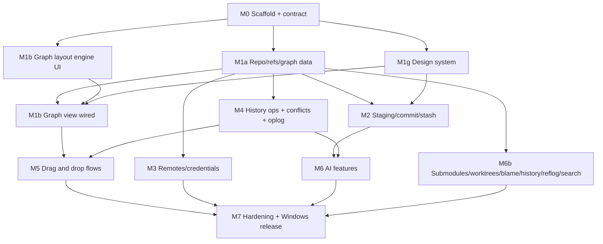

# gittrunk — Implementation Plan

Status: **M0–M7 complete; M8 (Android) merged, its CI build in flight; M9 (desktop redesign, forge integration, read-only mobile) planned.** M0–M7 are merged on the integration branch; the full quality gate, the e2e suite and the Windows installer build pass (see §10). M8 adds an Android build (§11). M9 is in §12.

gittrunk is a cross-platform desktop Git client (alternative to GitKraken) built with Tauri 2. Windows (`.exe` + NSIS installer + MSI) is the release target; macOS and Linux build from the same codebase.

---

## 1. Stack decisions

The brief's stack is kept. Deviations and clarifications, each with a two-sentence justification:

| Area                                | Decision                                                                                                                                                    | Justification                                                                                                                                                                                                                                                                                                |
| ----------------------------------- | ----------------------------------------------------------------------------------------------------------------------------------------------------------- | ------------------------------------------------------------------------------------------------------------------------------------------------------------------------------------------------------------------------------------------------------------------------------------------------------------ |
| Network ops (clone/fetch/pull/push) | **System `git` CLI**, not libgit2                                                                                                                           | libgit2 does not read `~/.ssh/config`, handles SSH agents and proxies poorly, and cannot use Git Credential Manager, which is how most Windows users authenticate to GitHub/GitLab/Bitbucket. Shelling out gives us exactly the user's existing auth setup, and progress is parsed from `--progress` stderr. |
| Graph layout                        | **Lane layout computed in Rust**, rendered on **Canvas 2D** with row virtualization; labels/text are DOM overlays only for visible rows                     | SVG with 100k+ commits creates too many nodes even when windowed, and computing lanes in JS blocks the UI thread. Rust computes lanes once per ref change and the frontend fetches visible row windows by index.                                                                                             |
| Diff display                        | **`@git-diff-view/react`** (split + unified, highlight.js-based highlighting via lowlight) for viewing; line/hunk selection layered on its line-click hooks | It is an existing, maintained diff component with both modes and syntax highlighting, so we don't rebuild a diff viewer. Staging semantics (patch building) stay in Rust, so the viewer only reports selected line ranges.                                                                                   |
| Conflict editor                     | **CodeMirror 6 + `@codemirror/merge`**                                                                                                                      | It provides a proven 3-way merge UI with editing, which the diff viewer does not. It also handles large files without virtualization work on our side.                                                                                                                                                       |
| Virtualization                      | **`@tanstack/react-virtual`**                                                                                                                               | Same family as TanStack Query, headless, and works for both DOM lists and computing canvas row windows.                                                                                                                                                                                                      |
| Keychain                            | **`keyring` crate** (Windows Credential Manager / macOS Keychain / Secret Service)                                                                          | One API over all three OS stores. Used for AI API keys and optional HTTPS tokens; git credentials otherwise go through the configured credential helper.                                                                                                                                                     |
| AI HTTP calls                       | **Made from Rust**, never from the webview                                                                                                                  | API keys never enter JS memory and no CSP exception is needed for provider domains. Streaming tokens are forwarded to the UI as typed Tauri events.                                                                                                                                                          |
| E2E tests                           | **WebdriverIO + `tauri-driver`** on Linux (xvfb) and Windows CI                                                                                             | It drives the real app against a real fixture repo, which the brief requires. `tauri-driver` does not support macOS, so macOS gets build + unit tests only.                                                                                                                                                  |
| Undo                                | **App operation journal** (`.git/gittrunk/oplog.jsonl`) recording ref/HEAD/index state before each operation, restored via the reflog OIDs                  | Raw reflog alone doesn't say which entries belong to one user action (a rebase writes many). The journal groups them so "Undo" reverts exactly one operation.                                                                                                                                                |

Everything else is as specified: Tauri 2, `git2`, React + TS + Vite, Tailwind, shadcn/ui (Radix), dnd-kit, Zustand, TanStack Query, `tauri-specta`, cmdk, lucide-react.

---

## 2. Environment constraints (please read)

These come from the environment this session runs in and change how parts of the brief are executed:

1. **Windows artifacts are built by GitHub Actions, not locally.** This container is Linux, so the local `pnpm tauri build` produces Linux bundles (`.deb`/`.AppImage`). The Windows `.exe`, NSIS and MSI come from a `windows-latest` workflow. The final milestone counts as done only when that workflow is green and has uploaded the installers as artifacts; I'll read the run status and logs through the GitHub API.
2. **Branch policy.** `main` holds only clean, checker-approved code and is the only source of releases (`v*` tags on `main` trigger `release.yml`, which refuses tags not on `main`). Development integrates on `claude/relaxed-allen-0mjwae`, the only branch this session can push. `feat/<area>-<task>` branches exist as **local worktrees only**; each is rebased and fast-forward merged into the integration branch after the checker passes, so history stays linear. At the end of each milestone, the integration branch is proposed to `main` through a pull request.
3. **The orchestrator role is played by this main session.** Claude Code subagents cannot spawn other subagents, so an `orchestrator` subagent could not dispatch work. `.claude/agents/orchestrator.md` is still written, for reuse and documentation, but here dispatching is done by the top-level session running Opus.
4. **Effort levels**: each agent file sets `model` and `effort` in frontmatter.
5. Linux Tauri system deps (`webkit2gtk-4.1`, etc.) are installed in this container, so `pnpm tauri build` runs locally for Linux bundles.
6. No code-signing certificate is available, so installers are unsigned (SmartScreen will warn). The workflow has a documented optional signing step that reads secrets.

---

## 3. Repository layout and ownership

```
gittrunk/
├── .claude/agents/            # orchestrator (shared, orchestrator only)
├── .github/workflows/         # build-agent
├── docs/                      # orchestrator (PLAN, ARCHITECTURE); DESIGN.md → design-system-agent; BUILD.md → build-agent
├── package.json, pnpm-lock.yaml, tsconfig*.json, vite.config.ts,
│   eslint/prettier config, tailwind.config.ts   # SHARED — orchestrator only
├── src-tauri/
│   ├── Cargo.toml, tauri.conf.json, capabilities/  # SHARED — orchestrator (build-agent for bundle/icons section)
│   ├── icons/                                    # build-agent
│   └── src/
│       ├── main.rs, lib.rs                       # SHARED — orchestrator
│       ├── ipc/                                  # CONTRACT — orchestrator only
│       │   ├── mod.rs        # command registration + specta export
│       │   ├── types.rs      # all DTOs crossing IPC
│       │   └── error.rs      # AppError { kind, message, detail }
│       ├── commands/         # thin handlers → services; per-area files owned by area agent
│       ├── git/              # rust-git-agent
│       │   ├── service.rs    # GitService trait
│       │   ├── libgit/       # git2-backed impl (reads, graph, diff, simple writes)
│       │   ├── cli/          # git CLI runner (network, rebase, cherry-pick seq, submodules, worktrees)
│       │   ├── graph/        # lane layout engine
│       │   ├── oplog/        # operation journal + undo
│       │   └── fixtures/     # test fixture builders
│       ├── remote/           # rust-git-agent (track d): credentials, keychain
│       └── ai/               # ai-agent: Provider trait, anthropic.rs, openai_compat.rs, prompts/
├── src/
│   ├── ipc/bindings.ts       # GENERATED by tauri-specta (committed; CI fails on drift)
│   ├── ipc/queries.ts        # TanStack Query hooks over bindings — frontend-agent
│   ├── design/               # design-system-agent: tokens.css, themes, components/ui/*, /design route
│   ├── features/
│   │   ├── graph/            # frontend-agent (track b)
│   │   ├── repo/             # frontend-agent (track a UI)
│   │   ├── staging/          # frontend-agent (track c)
│   │   ├── remotes/          # frontend-agent (track d)
│   │   ├── operations/       # frontend-agent (track e): dnd, confirm+preview dialogs, rebase editor
│   │   ├── ai/               # ai-agent (UI for its features)
│   │   └── settings/         # design-system-agent (track g)
│   ├── app/                  # shell, routing, command palette, shortcuts — frontend-agent
│   └── stores/               # Zustand stores, one file per feature, owned by that feature's agent
├── e2e/                      # frontend-agent (spec) + build-agent (runner config)
└── README.md                 # orchestrator
```

Rule: an agent writes only inside its owned paths. Contract or shared config changes are requested from the orchestrator, which applies them on the integration branch before the feature branch rebases.

---

## 4. IPC contract (defined in Phase 0)

- Single source of truth: Rust types in `src-tauri/src/ipc/types.rs` deriving `serde` + `specta::Type`. `tauri-specta` exports `src/ipc/bindings.ts` on debug builds and via `cargo run --example export-bindings` in CI; CI runs it and fails on `git diff --exit-code src/ipc/bindings.ts`.
- All commands are `async` and return `Result<T, AppError>`. `AppError.kind` is a closed enum: `NotARepo | Conflict | DirtyWorktree | AuthRequired | AuthFailed | Network | RefNotFound | InvalidInput | GitCli | AiDisabled | AiProvider | Io | Internal`.
- Repositories are addressed by `RepoId` (an opaque handle returned by `repo_open`); backend holds a `RepoRegistry` with a file watcher that emits `repo_changed { repo_id, scopes: [refs|index|worktree|config] }` so TanStack Query invalidates precisely.
- Long operations return an `OpId` immediately and stream `op_progress { op_id, phase, percent?, message }` then `op_finished { op_id, result }` events. Cancel via `op_cancel`.
- Every mutating command takes `dry_run: bool`; with `dry_run = true` it returns an `OpPreview` (resulting ref positions, commits created/dropped, predicted conflicts via in-memory merge) without touching disk. This is what powers confirm-with-preview for drag and drop and AI plans.

Command groups (stubs returning `Internal("not implemented")` in Phase 0, fully typed):

| Group       | Commands                                                                                                                                                                                            |
| ----------- | --------------------------------------------------------------------------------------------------------------------------------------------------------------------------------------------------- |
| repo        | `repo_open`, `repo_init`, `repo_clone`, `repo_close`, `repo_recent`, `repo_status`                                                                                                                  |
| graph       | `graph_load(repo, filter) → GraphMeta {row_count, lane_count}`, `graph_rows(repo, start, len) → Vec<GraphRow>`, `graph_search(repo, query) → Vec<row_index>`, `commit_details`, `commit_diff`       |
| refs        | `refs_list`, `branch_create/delete/rename`, `checkout`, `tag_create/delete`, `ref_move`                                                                                                             |
| worktree    | `status`, `diff_file(staged, context)`, `stage_paths`, `unstage_paths`, `stage_lines(path, hunks/lines)`, `unstage_lines`, `discard_lines`, `commit(message, amend)`                                |
| stash       | `stash_list/save/apply/pop/drop`                                                                                                                                                                    |
| history ops | `merge`, `rebase`, `rebase_interactive(todo)`, `rebase_continue/skip/abort`, `cherry_pick(commits)`, `revert`, `reset(mode)`                                                                        |
| conflicts   | `conflict_list`, `conflict_file(path) → {base, ours, theirs, merged}`, `conflict_resolve(path, content)`                                                                                            |
| remotes     | `remote_list/add/remove/rename/set_url`, `fetch(remote?)`, `pull`, `push(remote, refspec, force_with_lease)`, `set_upstream`, `credential_store/clear`                                              |
| advanced    | `submodule_list/update/init`, `worktree_list/add/remove`, `blame`, `file_history`, `reflog`                                                                                                         |
| oplog       | `oplog_list`, `undo`, `redo`                                                                                                                                                                        |
| ai          | `ai_config_get/set`, `ai_key_set/clear`, `ai_commit_message`, `ai_conflict_suggest`, `ai_plan(nl) → AiPlan {steps: Vec<PlannedCommand>, preview}`, `ai_plan_execute(plan_id)`, `ai_summarize(commit | branch)`, `ai_pr_description(base, head)` |
| settings    | `settings_get/set`, `keybindings_get/set`                                                                                                                                                           |

---

## 5. Milestones and dependency graph



### M0 — Scaffold (sequential; orchestrator + build-agent + design-system-agent)

- Tauri 2 + React/TS/Vite with pnpm; ESLint (flat config) + Prettier; rustfmt + clippy config; Vitest + Testing Library; Tailwind wired to CSS variables.
- `.claude/agents/*.md` for all 7 agents.
- Full IPC contract (types + stub commands) and generated `bindings.ts`, plus the drift check.
- Design token skeleton (`src/design/tokens.css`, Tailwind mapping), app shell with gradient chrome.
- CI: `ci.yml` (ubuntu + windows: fmt, clippy, cargo test, lint, typecheck, test, bindings drift) and `release.yml` (windows `tauri build`, upload NSIS + MSI + exe).
- **Accept**: all quality-gate commands pass on the stub app; the Windows workflow produces an installer for the empty shell. Proving the pipeline early removes the biggest late risk.

### M1 — Read path (parallel: tracks a, b, g)

- **a (rust-git-agent)**: `GitService` trait, libgit2 impl for open/refs/status/commit details/diffs; graph walker (topo + date order, first-parent option) and lane assignment returning windowed rows; fixture builders (linear, branchy merges, octopus, 100k-commit synthetic repo).
- **b (frontend-agent)**: canvas graph renderer (lanes, nodes, merge curves, ref labels, tags, HEAD, selection), virtualized with overlays; commit details panel; search box and filters (branch, author, date, path, text).
- **g (design-system-agent)**: tokens (color, spacing, radius, type, elevation, motion, gradients), dark + light themes, wrapped components (Button, IconButton, Input, Dialog, AlertDialog, DropdownMenu, ContextMenu, Tooltip, Tabs, Toast, Badge, Kbd, ScrollArea, Resizable panels, CommandPalette), `/design` route in dev.
- **Accept**: open a fixture repo and scroll 100k commits at 60 fps (a perf test asserts `graph_rows` < 5 ms per 200-row window and first graph load < 1.5 s for 100k commits in release mode).

### M2 — Working copy (track c)

- Status, file / hunk / line stage–unstage–discard (patch building in Rust via `git2::Diff` + `apply` to the index), commit / amend, stash CRUD, split/unified diff with highlighting.
- **Accept**: Rust tests cover partial staging of added, removed and modified lines, including files with no trailing newline and CRLF files. A component test covers line selection → `stage_lines` call.

### M3 — Remotes (track d)

- Multiple remotes CRUD, per-remote fetch/push, pull (merge/rebase/ff-only per setting), upstream tracking, ahead/behind, clone with progress, auth: system credential helper via CLI with `GIT_TERMINAL_PROMPT=0` + an askpass bridge back to a UI prompt; optional token storage in keychain.
- **Accept**: tests against local bare-repo remotes (file:// and a local `git daemon`/`http-backend` fixture); auth failure surfaces `AuthRequired` and a prompt.

### M4 — History operations (track e, backend-heavy)

- Branch/checkout/merge/rebase/interactive rebase (CLI with a generated `GIT_SEQUENCE_EDITOR` todo), cherry-pick, revert, reset, tags; conflict state detection + 3-way data; oplog journal with undo/redo; `dry_run` previews for every mutation.
- **Accept**: each op has fixture tests for the success, conflict and abort paths; undo restores refs/HEAD/index exactly (asserted by OID comparison).

### M5 — Drag and drop (track e, frontend)

- dnd-kit on graph and branch list: branch → branch (menu: merge / rebase), commit → branch (cherry-pick), ref → commit (move ref / reset), interactive rebase editor with drag reorder, drop onto commit to squash/fixup, pick/edit/drop/reword actions.
- Every destructive drop → confirmation dialog showing the `OpPreview` (a mini before/after graph) → execute → toast with **Undo**.
- Keyboard alternative for every drag action (accessibility).
- **Accept**: E2E test opens a fixture repo, renders the graph, drags `feature` onto `main`, confirms the merge, and asserts the new merge commit appears in the graph and in `git log` on disk.

### M6 — AI (track f) and advanced Git (track h, rust-git-agent + frontend-agent)

- **AI**: `Provider` trait (Anthropic default; OpenAI-compatible second provider covers OpenAI, Azure, local Ollama/LM Studio). Features: commit message from staged diff, conflict suggestions, NL → `AiPlan` (only whitelisted `PlannedCommand` variants, each rendered with its `OpPreview`, executed only on explicit confirm, fully undoable), commit/branch summaries, PR description draft. AI is **off by default**; with AI disabled, no network code path is reachable (asserted by a test). Diffs are size-capped and the user sees what will be sent.
- **Advanced**: submodules, worktrees, blame, file history (follows renames), reflog view.
- **Accept**: AI provider tested against a mock HTTP server; plan executor tested to reject non-whitelisted commands.

### M7 — Hardening and release (checker + build-agent)

- Command palette covering every action; keyboard shortcuts map (editable); focus states audited; error toasts with details; settings (theme, AI, git binary path, pull strategy).
- Docs: `README.md`, `docs/BUILD.md`, `docs/ARCHITECTURE.md`, `docs/DESIGN.md`.
- **Accept (definition of done)**: full quality gate passes locally and in CI; Windows release workflow is green and uploads `gittrunk.exe`, `*-setup.exe` (NSIS), `*.msi`.

---

## 6. Agent team

Files in `.claude/agents/`. Each has a narrow `tools` list and a prompt that tells it to read only its brief, the contract files and its owned files.

| Agent               | Model  | Effort | Tools                                                                           | Owns                                                                                                           |
| ------------------- | ------ | ------ | ------------------------------------------------------------------------------- | -------------------------------------------------------------------------------------------------------------- |
| orchestrator        | opus   | high   | Read, Grep, Glob, Write/Edit (docs + contract + shared config only), Bash (git) | PLAN, contract, shared config                                                                                  |
| rust-git-agent      | sonnet | medium | Read, Grep, Glob, Edit, Write, Bash (cargo, git)                                | `src-tauri/src/git/`, `remote/`, `commands/{repo,graph,refs,worktree,stash,history,remotes,advanced,oplog}.rs` |
| frontend-agent      | sonnet | medium | Read, Grep, Glob, Edit, Write, Bash (pnpm)                                      | `src/features/*` (except ai, settings), `src/app/`, `src/ipc/queries.ts`, `e2e/` specs                         |
| design-system-agent | sonnet | medium | Read, Grep, Glob, Edit, Write, Bash (pnpm)                                      | `src/design/`, `src/features/settings/`, `docs/DESIGN.md`                                                      |
| ai-agent            | sonnet | medium | Read, Grep, Glob, Edit, Write, Bash (cargo, pnpm)                               | `src-tauri/src/ai/`, `commands/ai.rs`, `src/features/ai/`                                                      |
| build-agent         | haiku  | low    | Read, Glob, Edit, Write, Bash                                                   | `.github/`, `src-tauri/icons/`, bundle section of `tauri.conf.json`, `scripts/`, `docs/BUILD.md`               |
| checker             | opus   | high   | Read, Grep, Glob, Edit, Bash                                                    | none; small integration fixes only, anything larger goes back to the owner with a failure report               |

**Dispatch template** (every task):

```
Goal: <one paragraph>
Branch/worktree: feat/<area>-<task>
Owned paths: <list>          Read-only contract: src-tauri/src/ipc/*, src/ipc/bindings.ts
Acceptance criteria: <bullets>
Prove it: <exact commands, e.g. cargo test -p gittrunk git::graph ; pnpm test src/features/graph>
Out of scope / needs orchestrator: contract or shared-config changes → report, do not edit
```

**Loop per task**: dispatch in an isolated worktree → agent commits (Conventional Commits, scoped) → checker runs the gate on the branch → pass: rebase onto integration branch, fast-forward merge, regenerate bindings check, push → fail: precise report back to owner. The checker runs the full gate again at each milestone.

Mechanical work (renames, boilerplate, config, docs formatting) goes to build-agent (haiku) and planning, integration and review stay on opus.

---

## 7. Quality gates

Per merge and per milestone:

```
cargo fmt --all --check
cargo clippy --all-targets -- -D warnings
cargo test
pnpm lint
pnpm typecheck
pnpm test
pnpm tauri build          # Linux locally; Windows via release workflow
```

Plus: bindings drift check and the E2E drag-and-drop merge test from M5 onward.

---

## 8. Risks

| Risk                                                          | Mitigation                                                                                                                                           |
| ------------------------------------------------------------- | ---------------------------------------------------------------------------------------------------------------------------------------------------- |
| Graph performance at 100k+ commits                            | Rust-side layout, windowed row fetch, canvas rendering, perf test in CI from M1                                                                      |
| libgit2 vs CLI behavioral drift (hooks, config, line endings) | All writes that involve hooks/sequencer go through CLI; libgit2 writes limited to index/ref updates; fixture tests run both paths where they overlap |
| `tauri-specta` v2 is still RC                                 | Pin exact versions; the contract is plain serde types so swapping the generator is contained to `ipc/mod.rs`                                         |
| Windows-only issues (path length, CRLF, GCM prompts)          | Windows CI job runs `cargo test` from M0; fixtures include CRLF + long paths                                                                         |
| AI leaking repository content                                 | Off by default, network code gated behind config, explicit preview of payload, keys only in keychain                                                 |

---

## 9. Approval log

- 2026-09-30: §1 stack deviations and §2 environment adaptations approved. `main` is reserved for clean code and releases.

## 10. Milestone status

| Milestone              | Status  | Evidence                                                                                                      |
| ---------------------- | ------- | ------------------------------------------------------------------------------------------------------------- |
| M0 Scaffold + contract | Done    | CI and Windows installer build green on the empty shell                                                       |
| M1 Read path           | Done    | 100k-commit graph: load ≈0.5 s, 200-row window ≈0.1 ms (release)                                              |
| M2 Working copy        | Done    | Line staging byte-exact incl. CRLF and missing final newline; e2e stage → commit → push → undo                |
| M3 Remotes             | Done    | Fetch/pull/push/clone against bare remotes; askpass bridge; keychain                                          |
| M4 History operations  | Done    | Merge, rebase, interactive rebase, cherry-pick, revert, conflicts, one-step undo                              |
| M5 Drag and drop       | Done    | e2e drags `feature` onto `main`, confirms the preview, verifies the merge commit's parents with git           |
| M6 AI + advanced Git   | Done    | Providers tested against a mock server; AI off by default; blame, file history, reflog, submodules, worktrees |
| M7 Hardening + release | Done    | Gate below; Windows `gittrunk.exe`, NSIS `*-setup.exe` and `*.msi` produced by the Build Windows workflow     |
| M8 Android             | Merged  | See §11; dispatches in `docs/dispatch/android/`; `Build Android` CI run in flight                             |
| M9 Redesign + forge    | Planned | See §12; dispatches in `docs/dispatch/m9/`                                                                    |

Quality gate at completion: `cargo fmt --check`, `cargo clippy -D warnings`, 257 Rust tests (also under a global `core.autocrlf=true`), frontend lint, format, typecheck, 251 component tests, `pnpm build`, `pnpm tauri build` (Linux bundles locally, Windows installers in CI) and 3 e2e specs.

Issues found by integration and CI, and fixed: Windows `core.autocrlf` breaking working-tree safety checks, a case-only filename clash that broke the Windows build, fixtures depending on the host's git identity, toasts covering the commit button, and a bundle identifier ending in `.app`.

Known limitations: installers are unsigned (SmartScreen warns); undoing a multi-step AI plan reverts one step at a time; the operation banner shows generic text for rebase progress; the interactive rebase squash affordance is a button rather than drop-onto-row.

## 11. Android (M8)

Goal: a sideloadable, installable Android APK of gittrunk built and verified on GitHub Actions, with the mobile UI, in which **clone over HTTPS with a token, history/graph, diff, stage, commit, branches, push and pull** work. Desktop behavior stays unchanged. Inputs: `docs/ANDROID_PLAN.md` (backend portability, embedded git, CI, release) and `docs/MOBILE_DESIGN.md` (UI adaptation). This section records the orchestrator's reconciliation; where it disagrees with those documents, this section wins. Dispatch briefs: `docs/dispatch/android/` (`COMMON.md` first).

### 11.1 Reconciliation decisions

| Topic                     | Decision                                                                                                                                                                                                                                                                                                                                                                                                              |
| ------------------------- | --------------------------------------------------------------------------------------------------------------------------------------------------------------------------------------------------------------------------------------------------------------------------------------------------------------------------------------------------------------------------------------------------------------------- |
| Platform detection        | Both mechanisms, for different questions. **Layout** (compact vs regular) comes from the viewport via `useLayout()`; **capabilities** come from the new `platform_info` IPC via `usePlatform()` (UA-based fallback on first paint). Never infer one from the other: an Android tablet is regular layout with mobile capabilities.                                                                                     |
| Capability flags          | Planner's `PlatformInfo` plus `supports_rebase`, `supports_submodules`, `supports_file_history`, backed by constants in `src-tauri/src/platform.rs` so the stretch package R1b-2 can flip them without touching the contract.                                                                                                                                                                                         |
| Shared UI plumbing timing | New package **S0** (Wave 0) owns `src/index.css` variants, mobile tokens, viewport meta, `useLayout`/`LayoutProvider`, the back-button stack and `setViewport()`. The designer placed `useLayout` in package A, but D's `Sheet`/`ResponsiveDialog` need it first.                                                                                                                                                     |
| Android back button       | Webview history sentinel (S0) plus a handler stack; exit via a new `app_exit` command. No capability/permission change, no `onBackButtonPress` in v1.                                                                                                                                                                                                                                                                 |
| Navigation contract       | A owns `src/stores/nav.ts` and `src/app/layout/registry.ts`; B and C contribute screens through `src/features/staging/mobile/contrib.ts` and `src/features/repo/mobile/contrib.ts`, created as stubs by A so ownership stays disjoint. Worktree diff (`worktreeDiff`, B) and commit file (`commitFile`, C) are distinct routes.                                                                                       |
| AI TLS                    | `webpki-roots` is a dependency on all targets and the preconfigured rustls client is used under `cfg(embedded_git)` (host-testable with `--features embedded-git`), not only under `target_os = "android"`.                                                                                                                                                                                                           |
| Android project           | Commit `src-tauri/gen/android`. C1 first tries `pnpm tauri android init --ci` locally with stub SDK/NDK env; if the output is complete (no stub paths, all template files) it is committed directly, otherwise the manual `android-init.yml` workflow generates and commits it. The workflow commits as `R4ph3rd <43202876+R4ph3rd@users.noreply.github.com>` with the session trailers and is kept for regeneration. |
| `tauri.android.conf.json` | Owned by C1 (build config), not R2.                                                                                                                                                                                                                                                                                                                                                                                   |
| Emulator smoke (C1c)      | **In this round**, folded into C1 as a non-blocking job (`continue-on-error`) that uploads logcat and a screenshot. Making it required is out of this round.                                                                                                                                                                                                                                                          |
| Advanced shim (R1b-2)     | **In this round as stretch** (Wave 2). Non-interactive rebase, worktrees, `log --follow`. If it misses the gate it is dropped and the flags stay false; the UI hides those features.                                                                                                                                                                                                                                  |
| Mobile test project       | Dropped. Mobile tests run in the normal Vitest run using `setViewport()`; no separate CI project.                                                                                                                                                                                                                                                                                                                     |
| SAF / open folder         | Out of v1 (`can_pick_folder = false` on Android). Repositories live in `<app_data_dir>/repos` and arrive by clone.                                                                                                                                                                                                                                                                                                    |
| Release job naming        | PR check job `Android APK` (required in the ruleset); release job `Android release APK`. Release signing hard-fails without the four `ANDROID_*` secrets.                                                                                                                                                                                                                                                             |
| Doc ownership             | C2 updates `README.md` and `docs/ARCHITECTURE.md` (delegated for this milestone); the orchestrator keeps `docs/PLAN.md`.                                                                                                                                                                                                                                                                                              |

### 11.2 Scope

In v1 (acceptance bar in bold): **clone over HTTPS with a token**, open cloned repos, **history/graph**, commit detail, **diff** (unified), **stage/unstage** (file and hunk), discard, **commit**/amend, **branches** (create, checkout, rename, delete), **fetch/pull/push**, stash, merge, cherry-pick, revert, reset, tags, reduced conflict resolution, undo, AI features, settings, git identity prompt, repo delete. The non-bold items come with the R1b-1 shim and the existing UI and are expected, but a failure there does not block the first APK.

Stretch in this round: R1b-2 (rebase incl. pull with rebase strategy, worktrees, file history follow), C1c smoke job.

Out of v1: SSH remotes, opening arbitrary folders (SAF), interactive rebase, submodule update/init, git hooks and commit signing, line-level staging and split diff on compact, drag and drop on touch, blame on compact, Android Keystore wrapping of secrets (v1.1), Play Store / AAB, user-installed CA certificates.

### 11.3 Waves, packages and merge order

Each wave's packages have disjoint file ownership and branch from the integration branch after the previous wave is merged. The main session merges in the listed order.

| Wave | Package  | Summary                                                                                       | Agent               | Model  | Depends on          |
| ---- | -------- | --------------------------------------------------------------------------------------------- | ------------------- | ------ | ------------------- |
| 0    | R0       | `embedded_git` cfg/feature, Android dep tables, `platform.rs`, new IPC + bindings, UI glue    | rust-git-agent      | sonnet | -                   |
| 0    | S0       | CSS variants, mobile tokens, viewport meta, `useLayout`, back stack, `setViewport`            | frontend-agent      | sonnet | -                   |
| 1    | R2       | File secret store, embedded startup (libgit2 config, CA), AI TLS, inert `git_path`            | rust-git-agent      | sonnet | R0                  |
| 1    | R1b-1    | Embedded git shim: commit, stash, merge, cherry-pick, revert, sequencer, switch, add/rm       | rust-git-agent      | sonnet | R0                  |
| 1    | R1a      | libgit2 network layer: clone/fetch/pull/push with token credentials                           | rust-git-agent      | sonnet | R0 (dialect of R1b) |
| 1    | UI-D     | Design-system mobile primitives (Sheet, ActionSheet, ResponsiveDialog, AppBar, BottomNav, …)  | design-system-agent | sonnet | S0                  |
| 1    | C1       | `gen/android`, customize script, build action + `Build Android` workflow, smoke, android-init | build-agent         | sonnet | R0                  |
| 2    | UI-A     | Mobile shell, nav store, screen registry, back handling, switcher, More, settings pages       | frontend-agent      | sonnet | S0, UI-D, R0        |
| 2    | R1b-2    | Stretch: shim rebase, worktrees, `log --follow`; flips capability constants                   | rust-git-agent      | sonnet | R1b-1, R1a          |
| 2    | C2       | Release job, host CI for embedded-git, ruleset, BUILD/RELEASING/README/ARCHITECTURE           | build-agent         | sonnet | C1, R1a, R1b-1, R2  |
| 3    | UI-B     | Changes, diff, composer, identity prompt, conflicts, stash, AI sheets                         | frontend-agent      | sonnet | UI-A, UI-D          |
| 3    | UI-C     | History, commit detail, branches, remotes, clone with token, action sheets, capability gating | frontend-agent      | sonnet | UI-A, UI-D          |
| -    | CHECK P1 | Wave 1 integrated gate + `Build Android` CI loop to a green APK (runs during Wave 2)          | checker             | opus   | Wave 1              |
| -    | CHECK P2 | Final gate, integration and workflow review, desktop/compact checks, all CI green             | checker             | opus   | Wave 3              |

Merge order: Wave 0: R0, S0. Wave 1: R2, R1b-1, R1a, UI-D, C1. Then push, CHECK P1 starts (and, if C1 used the fallback, the main session runs `android-init` first). Wave 2: UI-A, R1b-2, C2 (CHECK P1 fixes merge whenever ready; its edit scope excludes Wave 2 files). Wave 3: UI-B, UI-C. Then CHECK P2.

Shared-file single owners: `Cargo.toml`/`Cargo.lock`/`build.rs`/`ipc/**`/bindings/`queries.ts`/`mockBindings.ts`/`testing.tsx` (R0, Wave 0; `testing.tsx` again UI-A in Wave 2), `src/index.css`/`index.html`/`tokens.css` (S0 in Wave 0, `tokens.css` additions by UI-D in Wave 1), `lib.rs` (R0 then R2), `platform.rs` (R0 then R1b-2), `docs/PLAN.md` (orchestrator). No package changes `package.json` or `pnpm-lock.yaml`.

### 11.4 Cross-package contracts

- Rust: `cfg(embedded_git)` (Android or `--features embedded-git`); `platform::{EMBEDDED, MOBILE, SUPPORTS_REBASE, SUPPORTS_WORKTREES, SUPPORTS_FILE_HISTORY}`; `ErrorKind::Unsupported`; `GitCli` shim entry `embedded::run` with per-file `run` for rebase/worktree/log; `CredentialResolver::ask`; pull merge-step dialect `merge --no-edit -m <msg> <oid>`, `merge --no-edit --ff-only <oid>`, `rebase <oid>`; `secrets::FileStore` behind `SecretStore` and `KeyStore`.
- IPC: `platform_info() -> PlatformInfo`, `app_exit()`, `git_identity_get() -> GitIdentity`, `git_identity_set(name, email) -> GitIdentity`, `repo_delete(path)`. Commands and bindings are identical on every platform; unsupported operations fail at runtime with `Unsupported`, and the UI hides them via `PlatformInfo`.
- UI: `usePlatform()` (`src/app/platform.ts`); `useLayout()`, `LayoutProvider`, `useBackHandler`, `installBackButton` (`src/app/layout/`); `setViewport()` (`src/test/viewport.ts`); design components listed in `UI-D.md`; `useNav()`, `Route`, `TabId` (`src/stores/nav.ts`); `ScreenContribution`, `ShellAppBar` (`src/app/layout/`); `stagingScreens` (B), `repoScreens` (C).
- CI: composite action `.github/actions/build-android` (inputs `abis`, `sign`, `keystore-base64`, `keystore-password`, `key-alias`, `key-password`, `lto`; outputs `apk-path`, `version`); PR check context `Android APK`; release job `Android release APK`; asset `gittrunk_<version>_android-universal.apk`.

### 11.5 Milestones and acceptance

| Milestone | Done when                                                                                                                                                                 |
| --------- | ------------------------------------------------------------------------------------------------------------------------------------------------------------------------- |
| M-A0      | After Wave 1 + CHECK P1: `Build Android` green, verified APK artifact (aarch64 + x86_64, dev-signed), `cargo test --features embedded-git` green on the host.             |
| M-A1      | Emulator smoke shows the app starting with the Welcome screen; clone/fetch/pull/push over HTTPS token pass host tests (R1a) and the flow is wired in the UI (UI-A, UI-C). |
| M-A2      | After Wave 3 + CHECK P2: mobile UI complete at 390x844, desktop unchanged at 1400x900 (Vitest, e2e, Build Windows), all CI workflows green.                               |
| M-A3      | Release rehearsal on a `v0.x.y-rc` with a real keystore (maintainer action: secrets). Not part of this round's builder work.                                              |

Quality gate for every package: see `docs/dispatch/android/COMMON.md` (`pnpm lint`, `pnpm format:check`, `pnpm typecheck`, `pnpm test` exit code, `cargo fmt --all --check`, `cargo clippy --all-targets -- -D warnings` with and without `--features embedded-git`, `cargo test` with and without it, bindings drift).

### 11.6 Risks

| Risk                                                                    | Mitigation / fallback                                                                                                                                     |
| ----------------------------------------------------------------------- | --------------------------------------------------------------------------------------------------------------------------------------------------------- |
| Vendored OpenSSL cross-build fails on CI                                | CHECK P1 fixes env first; after 3 targeted attempts, a separate dispatch replaces the transport with a reqwest smart-HTTP subtransport and drops OpenSSL. |
| Shim fidelity (exit codes, conflict messages) diverges from git         | Existing suite as a parity test under `--features embedded-git`; unsupported paths return `Unsupported`; UI hides them by capability.                     |
| Android-only compile errors invisible locally                           | `embedded-git` host feature covers our code; `cargo tree --target aarch64-linux-android` checks the graph; first CI run right after Wave 1.               |
| Parallel Rust builders and limited disk                                 | Shared `CARGO_TARGET_DIR`, `CARGO_PROFILE_DEV_DEBUG=0`, `CARGO_INCREMENTAL=0`; no `cargo clean`.                                                          |
| Local `tauri android init` with stub env produces an incomplete project | Completeness checklist in `C1.md`; fallback `android-init` workflow.                                                                                      |
| Release blocked until secrets exist                                     | Documented in `RELEASING.md`; maintainer creates the keystore and four secrets before the next release.                                                   |
| Required `Android APK` check adds 20-40 minutes to PRs                  | Thin LTO, caches, cancel-in-progress; if too slow, PR builds become aarch64-only (orchestrator decision).                                                 |
| Secrets stored plaintext (0600) in the app sandbox                      | `allowBackup=false`, `SecretStore` seam for Keystore wrapping in v1.1; documented.                                                                        |
| CI APKs are signed with throwaway keys and cannot update each other     | Workflow notice and BUILD.md; releases use the fixed keystore.                                                                                            |

## 12. M9 desktop redesign + forge (issues/comments)

Goal: act on the maintainer's annotated screenshot of the desktop shell (repo tabs, toolbar, refs sidebar, graph with author/date/oid columns, commit detail with the diff inside the right panel). The desktop becomes a VS Code-like workbench with a new neutral dark palette and a pinky-red accent; commits show avatars; branch colors follow the graph lanes everywhere; a terminal and a changes panel can be toggled; diffs and issues take the center. GitHub issues and comments arrive on desktop and mobile, and the Android build becomes read-only for git writes ("check and follow"). Dispatch briefs: `docs/dispatch/m9/` (`COMMON.md` first; it extends `docs/dispatch/android/COMMON.md`).

### 12.1 Reading of the annotations

| Mark                     | Request                                                          | Decision                                                                                                                                                                                                                                                                                                                                                  |
| ------------------------ | ---------------------------------------------------------------- | --------------------------------------------------------------------------------------------------------------------------------------------------------------------------------------------------------------------------------------------------------------------------------------------------------------------------------------------------------- |
| 1 (repo tabs)            | Tabs visually linked with the view below                         | Browser/VS Code tabs: darker tab strip (`--tabbar-bg`); the active tab has the toolbar's background (`--tab-active-bg` = `--toolbar-bg`), rounded top corners, a 2px accent top indicator and no bottom border, so it flows into the toolbar. "Open" becomes a `+` icon button after the last tab.                                                        |
| 2 (left of Fetch)        | Undo button with a chevron whose dropdown has "Redo"             | Split button `Undo` + chevron at the toolbar's left edge; the menu holds "Redo <description>". Both go through the existing preview dialog (`history.undo`, new `history.redo` = `mod+shift+z`). Enabled state and tooltips come from a new `oplog_state` IPC. The existing redo selection bug (redo after two undos jumps two steps) is fixed in R-CORE. |
| "branch", "stash" boxes  | Toolbar buttons after Push                                       | `Branch` opens the existing name prompt (create at HEAD, `mod+shift+b`); `Stash` opens the existing stash dialog (disabled when the tree is clean, `mod+shift+s`).                                                                                                                                                                                        |
| "+ local" on BRANCHES    | Rename section, add "+"                                          | Section title `Local`; a `+` in its header creates a branch at HEAD (same prompt).                                                                                                                                                                                                                                                                        |
| "ISSUES" under WORKTREES | Issues in the sidebar                                            | New last sidebar section `Issues`: open issues of the GitHub `origin` (first 10), `+` for a new issue, "Show all"; an issue opens in the center.                                                                                                                                                                                                          |
| 3 (Author/Committer)     | Avatars                                                          | Avatars in commit details, graph nodes, hover card, issues, comments and mobile rows. See 12.2 Avatars.                                                                                                                                                                                                                                                   |
| 4 (ref chip)             | Branch color on every branch chip                                | Every ref chip (graph, commit details, mobile) uses its commit's lane color; sidebar branches and tags get a lane-colored icon. Colors come from `GraphMeta.refColors`. Tags are colored too and keep a tag icon; stashes stay neutral.                                                                                                                   |
| 5 (top right)            | VS Code layout buttons: bottom terminal, right changes panel     | Three toggles at the right end of the tab strip: left sidebar (`mod+b`), bottom panel with a terminal (`mod+j`), right panel (`mod+alt+b`). Persisted in localStorage.                                                                                                                                                                                    |
| 6                        | List/tree toggle at the top of Unstaged                          | Two joined buttons (list / tree) in the Unstaged section header; the mode applies to all sections and persists.                                                                                                                                                                                                                                           |
| 7                        | Staged vs Unstaged separation                                    | Each section is a distinct block with a sticky header, a colored left rule and count (unstaged: warning, staged: success tint), separated by a divider. Staged sits directly above the commit box.                                                                                                                                                        |
| 8                        | Pinky-red accent, darker neutral dark theme, coherent light      | Palette in 12.2; AA contrast enforced by a unit test over `tokens.css`.                                                                                                                                                                                                                                                                                   |
| 9                        | Android: browse, follow, comment, issues only                    | `PlatformInfo.readOnly` (true on Android). See 12.2 Mobile. Forge = GitHub via the `origin` remote; a `Forge` trait leaves room for GitLab.                                                                                                                                                                                                               |
| 10                       | No author column; avatar inside the graph node                   | Commit nodes become 18px avatar discs with a lane-colored ring; fallback initials on a lane-colored disc; merge commits stay small hollow nodes.                                                                                                                                                                                                          |
| 11                       | Branch/tag labels left of the graph lines                        | A fixed refs column (176px) before the lane gutter, chips right-aligned, "+N" overflow, a thin lane-colored connector from the column to the node.                                                                                                                                                                                                        |
| 12                       | No date / oid columns; show them on hover above the full message | A hover card (500ms delay, focusable, stays while hovered) with author avatar, name, email, absolute + relative date, short and full oid with copy buttons, and the full message. Rows keep screen-reader-only date and oid text.                                                                                                                         |
| 13                       | Diff viewer in the center                                        | The center is a router: graph (default), commit file diff, working-copy diff (with line staging), issue list, issue, new issue. A header with "Back to graph" (Esc) returns; the graph stays mounted (hidden) so scroll and selection survive.                                                                                                            |

### 12.2 Decisions

| Topic                 | Decision                                                                                                                                                                                                                                                                                                                                                                                                                                                                                                                                                                                                                                                                                                                                                                                                                                   |
| --------------------- | ------------------------------------------------------------------------------------------------------------------------------------------------------------------------------------------------------------------------------------------------------------------------------------------------------------------------------------------------------------------------------------------------------------------------------------------------------------------------------------------------------------------------------------------------------------------------------------------------------------------------------------------------------------------------------------------------------------------------------------------------------------------------------------------------------------------------------------------ |
| Right panel           | Two tabs, **Commit** (selected commit's details) and **Changes** (working copy: file lists + commit box). Selecting a commit switches to Commit, selecting the WIP row switches to Changes; the user can switch freely. Files clicked in either tab open their diff in the center. This keeps today's selection-driven panel (item 5) while moving diffs out (item 13). Commit comments appear at the bottom of the Commit tab when the repo has a GitHub origin.                                                                                                                                                                                                                                                                                                                                                                          |
| Layout                | Tab strip (brand, tabs, `+`, layout toggles) / toolbar (Undo, Fetch, Pull, Push, Branch, Stash) / horizontal group: sidebar, center column (center view above a resizable bottom panel), right panel. State `{ sidebar, bottom, right }` (defaults true, false, true) in `src/stores/layout.ts`, persisted in localStorage `gittrunk.layout.v1` (one window today, so per-window = per-app). Shortcuts through the command registry, so they are rebindable in Settings > Keyboard.                                                                                                                                                                                                                                                                                                                                                        |
| Terminal              | Desktop only (`PlatformInfo.supportsTerminal`, false on Android). Backend `portable-pty 0.9` (ConPTY on Windows); commands `terminal_open/write/resize/close`, output streamed with typed events `TerminalOutput { id, data }` (UTF-8, split sequences carried over) and `TerminalExit { id, code }`. Shell: `$SHELL -l` (fallback `/bin/sh`) on unix, `pwsh.exe` else `powershell.exe -NoLogo` on Windows; cwd = repo root; `TERM=xterm-256color`. Frontend `@xterm/xterm 6` + `@xterm/addon-fit 0.11`, lazy loaded, colors from tokens. One session per repo, alive while the repo tab is open (hidden panel keeps it), killed on tab close and app exit.                                                                                                                                                                                |
| Avatars               | Fetched **in Rust** (`avatars_get`) and returned as `data:` URLs, cached in memory and in the app cache dir (hits 7 days, misses 1 day). The webview never contacts avatar hosts, so the CSP stays unchanged (`img-src` already allows `data:`) and no referrer leaks. Sources: GitHub noreply emails (`<id>+<login>@users.noreply.github.com`, `<login>@users.noreply.github.com`) and GitHub logins (issues) via GitHub; other emails via Gravatar (SHA-256 of the trimmed lower-case email, `d=404`). Setting `avatars: off / github / githubAndGravatar`, default **github** (private by default: no email hash leaves the machine); Settings > Integrations offers "GitHub + Gravatar" with a note that Gravatar receives email hashes of commit authors, or "Off". Fallback everywhere: initials on a lane-colored (or accent) disc. |
| Forge                 | `src-tauri/src/forge/`: a `Forge` trait (boxed futures, same pattern as `ai::provider::Provider`) with `GithubForge` on reqwest (REST v3, `X-GitHub-Api-Version: 2022-11-28`). Owner/repo from the `origin` URL (https, scp and ssh forms), else the first GitHub remote. GitLab remotes are detected and reported as unsupported for now. Token: dedicated secret (`gittrunk-forge` / host) in the keychain or, on Android, the file store; fallback to the HTTPS credential remembered for the host (so an Android clone token works immediately). The token is validated with `GET /user` before it is stored and never crosses IPC or logs. Public repos list issues without a token (rate-limited); writes need one. Issue and comment bodies are plain text (no Markdown/HTML rendering: untrusted content in a privileged webview). |
| Mobile read-only      | `PlatformInfo.readOnly` (`platform::READ_ONLY = MOBILE`), a capability, not a layout: an Android tablet in regular layout is read-only too. Kept: clone, open/switch/delete repos, history, commit details and diffs, branches/remotes/tags browsing, checkout of existing branches (to follow another branch), fetch, pull **fast-forward only**, reflog, file history, AI summaries, settings, issues and comments. Hidden: the Changes tab and its routes (stage, discard, commit, conflicts, stash), push, branch/tag create/rename/delete, merge/rebase/cherry-pick/revert/reset, remote add/edit/rename/remove, undo, Ask AI plans, the palette entry, drag and drop. UI gating only: the embedded shim and write commands stay (tests keep running, M8 code is not deleted).                                                        |
| Mobile navigation     | Bottom tabs History, Branches, Issues, More when read-only (History, Changes, Branches, Issues, More otherwise, e.g. a narrow desktop window). Issues tab: list (open/closed), issue page with comments and a composer, "New issue". Commit page: comments + composer.                                                                                                                                                                                                                                                                                                                                                                                                                                                                                                                                                                     |
| Palette               | Neutral near-black surfaces without blue tint, pinky-red accent. Dark: bg `#0c0c0d`, surface `#161618`, raised `#1c1c1f`, border `#2a2a2e`, fg `#ececef`, muted `#a3a3ab`, subtle `#8a8a92`, accent `#ff4f7b` (fg `#1a070d`), danger `#ff6a4d` (coral, distinct from the accent), success `#3ecf8e`, warning `#f5b83d`. Light: bg `#fafafa`, surface `#ffffff`, fg `#18181b`, accent `#d6195a` (fg white), danger `#c2410c`. Lanes: 8 harmonized hues per theme, lane 0 = accent. Full list in `docs/dispatch/m9/P0.md`; every text pair ≥ 4.5:1 and lanes ≥ 3:1 on surfaces, asserted by `src/design/contrast.test.ts`.                                                                                                                                                                                                                   |
| Ref colors            | `GraphMeta.refColors: RefColor[] { fullName, color }` computed in the graph build (tip commit's lane color) and read with `useRefColors(repoId)`; CSS via `laneVar(color)` = `var(--lane-N)`. Refs outside the filtered graph fall back to neutral.                                                                                                                                                                                                                                                                                                                                                                                                                                                                                                                                                                                        |
| Graph geometry        | Desktop metrics change (node radius 9, lane pitch 24, max gutter 320, row height 28 kept); compact metrics unchanged.                                                                                                                                                                                                                                                                                                                                                                                                                                                                                                                                                                                                                                                                                                                      |
| Commit diff viewer    | The center reuses `FileDiffView` for commit files and `DiffViewer` (line staging) for working-copy files. Upgrading commit diffs to the highlighted viewer is out of scope.                                                                                                                                                                                                                                                                                                                                                                                                                                                                                                                                                                                                                                                                |
| Visual review harness | New dev-only `/preview` route mocks the IPC layer with `@tauri-apps/api/mocks` fixtures so the real shell renders in Chromium; `scripts/preview-shots.mjs` takes Playwright screenshots (desktop 1400x900 dark/light, compact 390x844). Not shipped in production bundles.                                                                                                                                                                                                                                                                                                                                                                                                                                                                                                                                                                 |

### 12.3 Scope

In: items 1-13 above; GitHub issues (list, view, create, comment) and commit comments on desktop and mobile; GitHub token settings; avatar setting; terminal on Windows/macOS/Linux; redo UI and the redo ordering fix; preview harness.

Out: GitLab/Bitbucket forges (trait seam only), GitHub Enterprise hosts, pull requests, issue editing/closing/labels/assignees, Markdown rendering, notifications, multiple terminals per repo and terminal profiles, opening links in the system browser (no opener plugin: URLs are copyable), avatars for non-GitHub forges, highlighted commit diffs, blame/file history in the center (they keep their dialogs), mobile avatar-in-node rows (compact rows keep their layout and only gain colored chips).

### 12.4 Contracts (single owner in Wave 0; exact shapes in `C0.md`)

- IPC (C0): `PlatformInfo.readOnly`, `PlatformInfo.supportsTerminal`; `AppSettings.avatars: AvatarMode`; `GraphMeta.refColors`; `oplog_state(repo) -> OplogState`; `avatars_get(subjects: AvatarSubject[], size) -> (string | null)[]`; `forge_status`, `forge_token_source`, `forge_token_set -> ForgeUser`, `forge_token_clear`, `forge_issues -> IssuePage`, `forge_issue -> IssueDetail`, `forge_issue_create -> Issue`, `forge_issue_comment -> ForgeComment`, `forge_commit_comments -> ForgeComment[]`, `forge_commit_comment -> ForgeComment`; `terminal_open -> id`, `terminal_write`, `terminal_resize`, `terminal_close`; events `TerminalOutput`, `TerminalExit`. No new `ErrorKind`. C0 lands stubs returning `NotImplemented`; R-CORE, R-FORGE and R-TERM fill the bodies without changing signatures.
- Rust (C0): `crate::http::client()` (shared reqwest client, rustls, webpki roots under `embedded_git`, `User-Agent: gittrunk/<version>`); `platform::{READ_ONLY, SUPPORTS_TERMINAL}`; managed state `terminal::Terminals`, `avatars::AvatarCache`.
- Frontend (C0): hooks in `src/ipc/queries.ts` (`useOplogState`, `useRedo`, `useAvatar`, `fetchAvatars`, `avatarKey`, `invalidateAvatars`, `useRefColors`, `useForgeStatus`, `useForgeTokenSource`, `useIssues`, `useIssue`, `useCreateIssue`, `useAddIssueComment`, `useCommitComments`, `useAddCommitComment`, `useSetForgeToken`, `useClearForgeToken`); stores `src/stores/layout.ts` and `src/stores/workspace.ts` (center view, right tab); `src/lib/laneColor.ts` (`laneVar`); `nav.ts` gains tab `issues`, routes `issue`, `newIssue`, settings section `integrations`; `SidebarParts` gains `Section.actions` and `Item.leading`; stubs `TerminalPanel`, `IssuesSection`, `ForgeMainView`, `CommitComments`, `forgeScreens`.
- Design (P0): tokens (12.2 palette plus `--tabbar-bg`, `--toolbar-bg`, `--tab-active-bg`, `--tab-hover-bg`, `--panel-header-bg`, `--lane-fg`, `--staged-*`, `--unstaged-*`, `--terminal-*`, `--avatar-ring`) mapped to Tailwind colors in `src/index.css`; `Avatar` component and `initials()` in `src/design/components/Avatar.tsx`.

### 12.5 Waves, packages and merge order

Wave 1 packages have disjoint owned files. Full-app integration tests (`App.test.tsx`, `staging.test.tsx`, `remotes.test.tsx`, `dnd.test.tsx`, `operations.test.tsx`, `shell.test.tsx`, `repo/mobile/mobile.test.tsx`) have one primary owner each; another package may adapt an assertion its own change breaks, in a separate `test(<scope>)` commit (see `docs/dispatch/m9/COMMON.md`).

| Wave | Package    | Summary                                                                                                       | Agent               | Model  |
| ---- | ---------- | ------------------------------------------------------------------------------------------------------------- | ------------------- | ------ |
| 0    | C0         | IPC types + stubs + bindings, deps, `http.rs`, ref colors, platform flags, query hooks, stores, UI stubs      | rust-git-agent      | sonnet |
| 0    | P0         | Palette and shell tokens, Tailwind mapping, `Avatar`, contrast test, DESIGN.md                                | design-system-agent | haiku  |
| 1    | R-CORE     | Avatar fetch/cache service, `oplog_state`, redo ordering fix                                                  | rust-git-agent      | sonnet |
| 1    | R-FORGE    | GitHub client, `Forge` trait, token store, forge commands, mockito tests                                      | rust-git-agent      | sonnet |
| 1    | R-TERM     | PTY sessions, terminal commands and events                                                                    | rust-git-agent      | sonnet |
| 1    | UI-GRAPH   | Refs column, avatar nodes, lane-colored chips, no author/date/oid columns, hover card                         | frontend-agent      | sonnet |
| 1    | UI-CHANGES | File list: list/tree toggle, staged/unstaged separation                                                       | frontend-agent      | sonnet |
| 1    | UI-SHELL   | Linked tabs, layout toggles, panels, center router, right panel tabs, commit details (avatars, comments slot) | frontend-agent      | sonnet |
| 1    | UI-TOOLBAR | Undo/Redo split button, Branch, Stash, redo command and dialog, read-only gating                              | frontend-agent      | haiku  |
| 1    | UI-SIDEBAR | `Local` + create, lane-colored branch/tag icons, mount Issues section                                         | frontend-agent      | haiku  |
| 1    | UI-TERM    | xterm bottom-panel terminal with persistent per-repo sessions                                                 | frontend-agent      | sonnet |
| 1    | UI-FORGE   | Issues section, center issue views, commit comments, mobile issue screens, Settings > Integrations            | frontend-agent      | sonnet |
| 1    | UI-MOBILE  | Read-only mobile, Issues tab, action filtering, fast-forward pull, commit comments on mobile                  | frontend-agent      | sonnet |
| 1    | PV         | `/preview` mocked-IPC route and Playwright screenshot script                                                  | frontend-agent      | sonnet |
| 2    | CHECK      | Full gate, e2e, visual review (desktop + compact), CSP/secrets/a11y review, fixes                             | checker             | opus   |
| 2    | D9         | ARCHITECTURE.md and README.md for M9 (delegated by the orchestrator)                                          | build-agent         | haiku  |

Merge order: Wave 0: C0, then P0. Wave 1: R-CORE, R-FORGE, R-TERM, UI-GRAPH, UI-CHANGES, UI-SHELL, UI-TOOLBAR, UI-SIDEBAR, UI-TERM, UI-FORGE, UI-MOBILE, PV (after each Rust package: `pnpm bindings && git diff --exit-code src/ipc/bindings.ts` must stay clean). Wave 2: CHECK and D9 in parallel (D9 touches only the two docs); CHECK's fixes merge last.

Shared-file single owners: `Cargo.toml`/`Cargo.lock`/`package.json`/`pnpm-lock.yaml`/`vite.config.ts`/`ipc/**`/bindings/`lib.rs`/`platform.rs`/`queries.ts`/`mockBindings.ts`/`testing.tsx`/`nav.ts`/`stores/{layout,workspace}.ts` (C0), `tokens.css`/`index.css` (P0), `docs/PLAN.md` (orchestrator). No Wave 1 package adds dependencies.

### 12.6 New dependencies

Rust: `portable-pty = "0.9"` (non-Android targets only), `sha2 = "0.10"`, `base64 = "0.22"`, `time = { version = "0.3", default-features = false, features = ["std", "parsing"] }` (the last three already in the lock graph). npm: `@xterm/xterm ^6.0.0`, `@xterm/addon-fit ^0.11.0`, `@radix-ui/react-hover-card ^1.1.23`. No Tauri plugin, capability or CSP change.

### 12.7 Acceptance

M9 is done when: every brief's acceptance list passes; the full gate is green (Rust with and without `embedded-git`, clippy, bindings drift, lint, format, typecheck, Vitest, `pnpm build`, node script tests); `pnpm e2e` passes at 1400x900; `/preview` screenshots (desktop dark and light, compact) were reviewed by CHECK; `cargo tree --target aarch64-linux-android -i portable-pty` does not resolve; CI (`CI`, `E2E tests`, `Build Windows`, `Build Android`) is green after the push.

### 12.8 Risks

| Risk                                                      | Mitigation                                                                                                                                              |
| --------------------------------------------------------- | ------------------------------------------------------------------------------------------------------------------------------------------------------- |
| Twelve parallel Wave 1 builders collide in full-app tests | Primary test owners, assertion-only adaptations in separate commits, merge order above; CHECK resolves leftovers.                                       |
| `portable-pty` on Windows (ConPTY) compiles only in CI    | Pure shell-selection logic unit tested on Linux; Windows compile proven by `Build Windows`/`CI` Windows leg; CHECK loops on CI.                         |
| Android build pulls desktop-only crates                   | `portable-pty` in the `cfg(not(target_os = "android"))` table; terminal code behind the same cfg; `cargo tree --target aarch64-linux-android` check.    |
| GitHub rate limits (60/h unauthenticated)                 | Status and issue queries cached (5 min stale time), no polling; rate-limit errors surface with the reset time and a hint to add a token.                |
| Avatar privacy                                            | Rust-side fetch, no webview requests, SHA-256 hashes, setting with "GitHub only"/"Off", documented in Settings and README. Maintainer may flip default. |
| Untrusted issue text in a privileged webview              | Plain-text rendering only (React text nodes), no `dangerouslySetInnerHTML`, no Markdown; CHECK greps for it.                                            |
| Terminal gives the webview a shell                        | Same trust level as existing git commands; desktop only; CSP unchanged (no remote script sources).                                                      |
| Layout rework breaks e2e selectors                        | COMMON lists the e2e invariants (`// WIP`, `Working copy`, `Stage all`, `Commit summary`, `Push`, undo dialog, `data-kind` badges); CHECK runs e2e.     |

### 12.9 Needs the maintainer

- A GitHub personal access token to try issues/comments on private repos (classic `repo` scope, or fine-grained with Issues read/write and Contents read/write), pasted in Settings > Integrations; on Android the clone token is reused when it has those permissions.
- Confirm the avatar default (Gravatar on by default) or switch it to "GitHub only".
